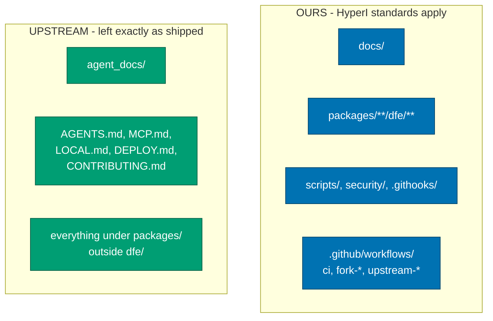

# dfe-hyperdx documentation

DFE's fork of [HyperDX](https://github.com/hyperdxio/hyperdx), embedded in the
DFE platform as its visualisation and search layer.

Two questions bring people here, and they are answered in different places:

| Question | Start at |
| --- | --- |
| **What does our fork do differently?** | [architecture/](architecture/README.md) |
| **How do we maintain the fork?** | [fork/](fork/README.md) |
| How do I run it locally? | [development/](development/README.md) |
| Why was it built this way? | [decisions/](decisions/README.md) |

---

## What is ours and what is upstream's

This matters more here than in a normal repo, because the answer decides whether
a change is free or expensive.



**Our files follow HyperI documentation standards. Upstream's files are left
untouched, including their docs.** Applying our conventions to `agent_docs/` or
`AGENTS.md` would buy nothing and create conflict surface on every sync.

`README.md` and `CLAUDE.md` are the two shared files: both exist upstream, both
carry a small catalogued delta of ours, and both are listed in `.fork-surface`.

---

## The documentation set

```
docs/
  architecture/    what the system is, and what DFE changes about it
  fork/            how the fork is held together and kept in sync
  development/     running it locally
  decisions/       ADRs - why we chose what we chose
```

Everything here is plain CommonMark plus fenced mermaid, so it renders on GitHub
today and drops into a docs generator later without a rewrite.
