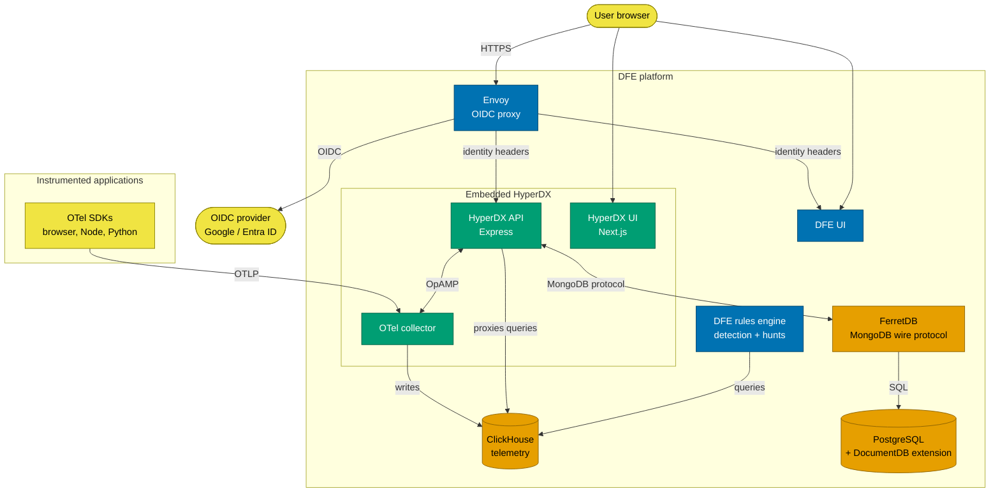
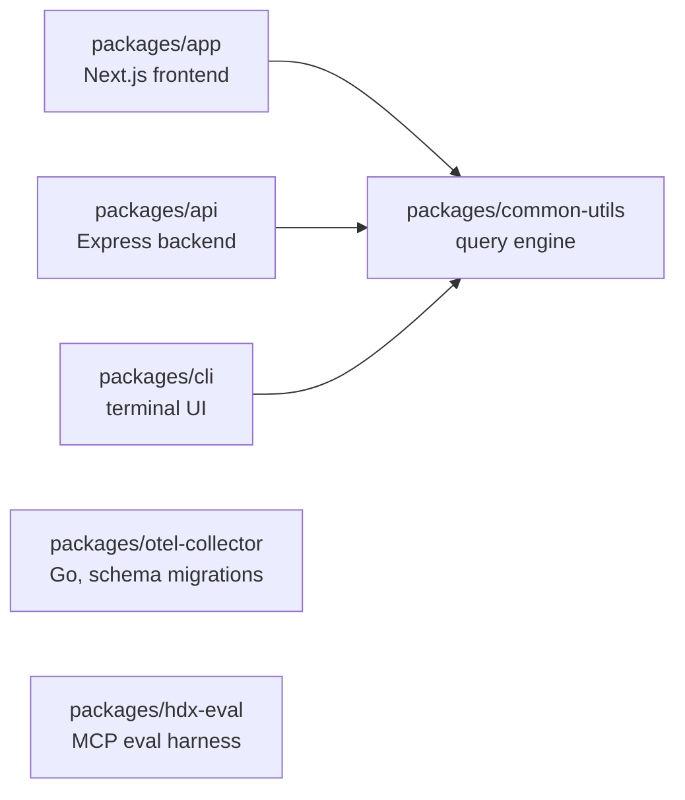

# Architecture

HyperDX is DFE's **visualisation and search layer**: engineers use it to search
logs, view traces, build dashboards and replay sessions. Detection, alerting and
response are the DFE platform's job, not HyperDX's.

Three things make our deployment different from stock HyperDX, and everything
else follows from them:

- **Authentication is external.** Envoy terminates OIDC and passes identity
  headers; HyperDX never sees a password.
- **Authorization is the DFE engine's.** It is the policy decision point, and
  ClickHouse GRANTs enforce data access.
- **MongoDB is replaced** by FerretDB over PostgreSQL.

What we changed to achieve that, and how we keep it working across upstream
releases, is [the fork documentation](../fork/README.md).

---

## The system

Colour encodes ownership: blue is DFE's, green is upstream HyperDX, orange is a
datastore, yellow is outside our boundary.

---

## Where things live

| Package                   | Role                                                             |
| ------------------------- | ---------------------------------------------------------------- |
| `@hyperdx/app`            | Frontend: search, dashboards, session replay                      |
| `@hyperdx/api`            | REST API, OpAMP server, MCP server, ClickHouse proxy              |
| `@hyperdx/common-utils`   | Isomorphic query engine, Lucene-to-SQL parser, Zod types          |
| `@hyperdx/cli`            | Terminal CLI and TUI (`hdx`)                                      |
| `@hyperdx/otel-collector` | Custom OTel Collector build, plus ClickHouse schema migrations    |
| `@hyperdx/hdx-eval`       | Benchmarks the MCP server against observability scenarios         |

Our additions live under `packages/api/src/dfe/**` and `packages/app/src/dfe/**`
so they cannot collide with upstream. Compose files and collector config are in
`docker/`.

---

## Read next

| Topic | Doc |
| --- | --- |
| How telemetry gets from an SDK to a chart | [data-flow.md](data-flow.md) |
| How a search becomes SQL | [clickhouse-data-model.md](clickhouse-data-model.md) |
| Frontend structure and state | [frontend.md](frontend.md) |
| API structure and the OpAMP/MCP servers | [backend.md](backend.md) |
| Envoy, the `x-oidc-*` contract, JWT verification | [oidc-authentication.md](oidc-authentication.md) |
| Who is allowed to see what | [authorization.md](authorization.md) |
| Turning a saved search into a DFE rule | [query-to-rule-pipeline.md](query-to-rule-pipeline.md) |
| FerretDB, PostgreSQL, service topology | [deployment.md](deployment.md) |
| Why we chose what we chose | [../decisions/](../decisions/) |

---

## Provenance

This documentation was assembled from Derek's original HyperDX-DFE embedding
design, the DFE Casbin RBAC work, the embedding code from devex, and a review of
the HyperDX codebase. Where a design has since changed, these docs describe what
the code does NOW and the superseded reasoning lives in
[../decisions/](../decisions/).
