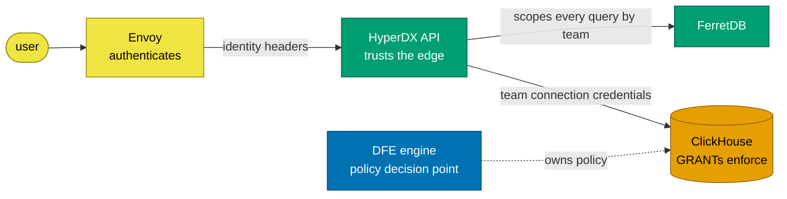

# Authorization

**The DFE engine decides, ClickHouse enforces, HyperDX trusts the edge.**

There is no authorization middleware inside HyperDX in this fork. Casbin RBAC
was removed as redundant - see [ADR 0004](../decisions/0004-casbin-removed.md)
for why.

---

## Who decides what

Three layers, each doing one thing:

1. **Envoy** proves who the user is and forwards `x-oidc-*` / `X-Forwarded-*`
   headers. See [oidc-authentication.md](oidc-authentication.md).
2. **HyperDX** maps that identity to a User and a Team, then scopes every query
   by `team`. This is upstream behaviour, not something we added - every route
   handler already does it, which is precisely why Casbin was redundant.
3. **ClickHouse** enforces data access with GRANTs. Each Team's `Connection`
   record carries a team-specific ClickHouse username and password, so a query
   that somehow escaped the application-level scoping still cannot read another
   team's data.

The DFE engine is the policy decision point for the wider platform. HyperDX does
not consult it per request; the decision is expressed as which ClickHouse
credentials a Team's connection holds.

---

## Why the last layer matters

Application-level scoping is a correctness property of upstream's code, and
upstream can change it. Data-layer GRANTs are ours, and they hold regardless.

That is the useful division: we do not try to re-implement upstream's tenancy
inside their code (which would be conflict surface we then have to defend on
every sync), we put our enforcement somewhere upstream cannot reach.

---

## What this means when you add a route

If you add a route under `packages/api/src/dfe/`, it inherits nothing
automatically. Scope your query by `req.user.team` the way upstream's handlers
do, and assume the ClickHouse credentials in play are already the right ones for
that team.
