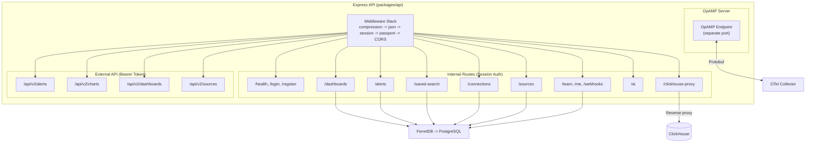
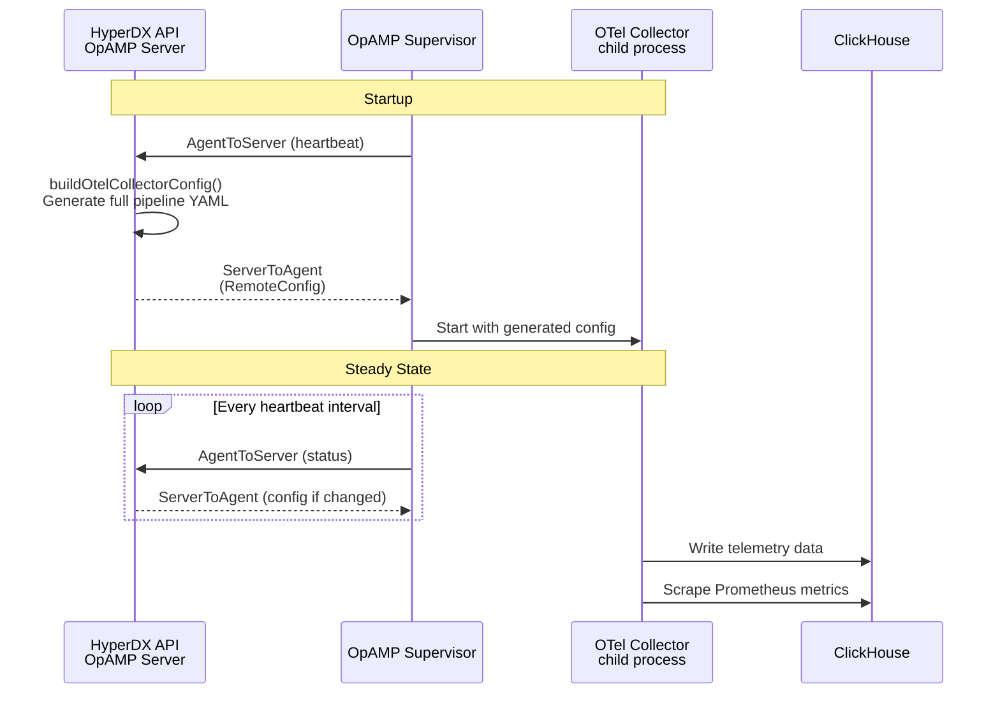

# Backend

> **Documentation status.** This page was carried over from the original
> embedding design and still reads in places as a PLAN ("changes required",
> "files to modify") rather than a description of what the code does today. The
> structure and diagrams have been corrected; the prose has not yet been
> re-verified against the code line by line. Treat a specific claim here as
> needing a check until this note is removed.

Authentication:

- **Internal routes** use Passport.js session auth (`passport-local-mongoose`)
  with sessions stored via `connect-mongo` (through FerretDB -> PostgreSQL in
  production). In local mode (single user), authentication is bypassed entirely.
- **External API** (`/api/v2/*`) uses Bearer token auth matching the user's
  `accessKey` field. Rate limited to 100 req/min.

### OTel Collector & OpAMP

The OTel collector runs under an **OpAMP supervisor** that manages its
lifecycle. The HyperDX API dynamically generates the collector's full pipeline
configuration (receivers, processors, connectors, exporters, and service
pipelines) based on team settings. This enables:

- **Remote configuration** - pipeline changes without collector restarts
- **Auth enforcement** - collector can require API keys when
  `collectorAuthenticationEnforced` is enabled on the team
- **Session replay routing** - the routing connector separates rrweb events into
  a dedicated pipeline and table

In **standalone mode** (no OpAMP), the collector uses static config files from
`docker/otel-collector/config.yaml`.

### Key Integrations

### Session Replay

Browser SDKs capture DOM mutations as **rrweb** events, shipped as OTLP logs
with a `rr-web.event` attribute. The collector routes these to
`hyperdx_sessions`. The frontend reconstructs playback using rrweb's `Replayer`
class, correlated to logs and traces via `rum.sessionId`.

### Dashboards

Stored as documents (via FerretDB -> PostgreSQL) as a set of **tiles**, each
containing a `SavedChartConfig` (source, display type, select/where/groupBy).
Dashboard-level filters apply across all tiles. Import/export is supported via
versioned JSON templates.

### Saved Searches

Persisted queries referencing a Source, with Lucene or SQL `where` clauses.
Stored as documents via FerretDB -> PostgreSQL. Displayed in the sidebar
navigation grouped by tags. Can have associated alerts.

### AI Assistant

Uses the Vercel AI SDK with Anthropic as the provider. The backend introspects
ClickHouse table metadata to provide schema context, then returns structured
chart/search/table configurations that the frontend renders directly.
