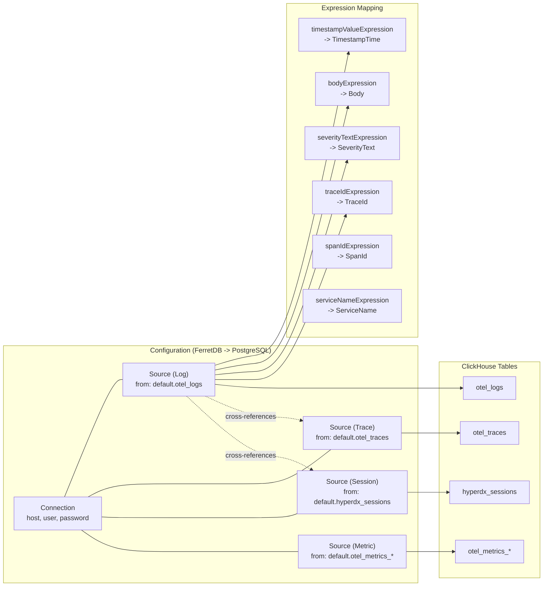
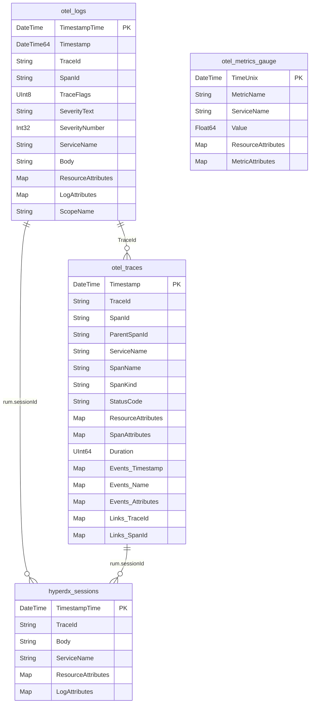

# ClickHouse data model

> **Documentation status.** This page was carried over from the original
> embedding design and still reads in places as a PLAN ("changes required",
> "files to modify") rather than a description of what the code does today. The
> structure and diagrams have been corrected; the prose has not yet been
> re-verified against the code line by line. Treat a specific claim here as
> needing a check until this note is removed.

The central architectural innovation: HyperDX is not tied to any specific table
schema. The **Source** model maps ClickHouse table columns to semantic roles via
SQL expressions.

Each Source has 20+ expression fields that map semantic concepts (timestamp,
body, severity, trace ID, span ID, service name, etc.) to arbitrary SQL
expressions over the underlying table. Sources cross-reference each other
(`logSourceId`, `traceSourceId`, `sessionSourceId`, `metricSourceId`), enabling
navigation between telemetry types.

This means HyperDX can work on top of **any** ClickHouse table - you point it at
your existing schema and map the columns.

### ClickHouse Data Model

All tables use:

- **MergeTree** engine with ZSTD compression
- **Partitioning** by `toDate(Timestamp)`
- **TTL** based on timestamp for automatic data expiry
- **Bloom filter indexes** on attribute map keys/values for fast filtering
- **tokenbf_v1** full-text index on Body/SpanName for text search
- **Materialized columns** for frequently-accessed nested attributes (e.g.,
  Kubernetes metadata, `rum.sessionId`)
