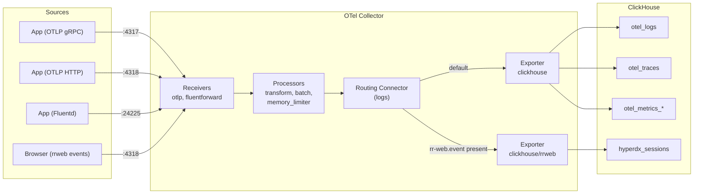
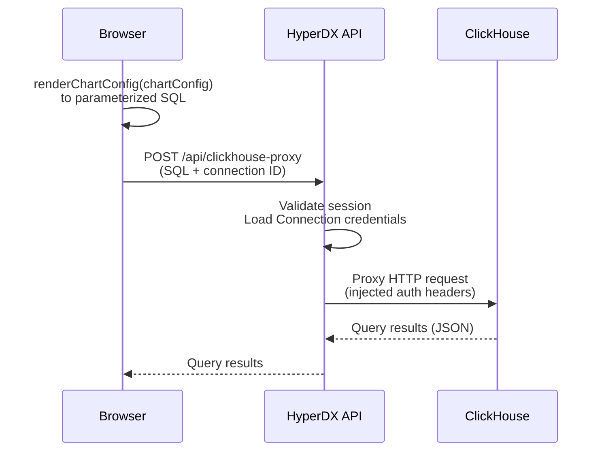
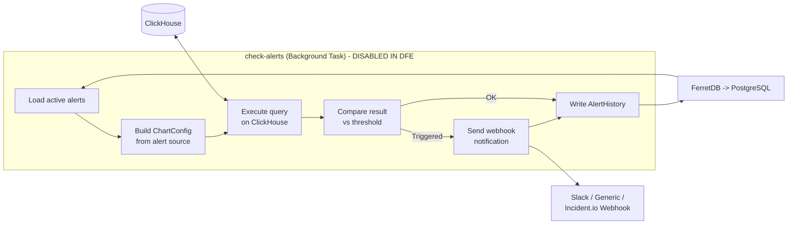

# Data flow

> **Documentation status.** This page was carried over from the original
> embedding design and still reads in places as a PLAN ("changes required",
> "files to modify") rather than a description of what the code does today. The
> structure and diagrams have been corrected; the prose has not yet been
> re-verified against the code line by line. Treat a specific claim here as
> needing a check until this note is removed.

### Write Path (Telemetry Ingestion)

Key details:

- **Receivers** accept OTLP (gRPC on 4317, HTTP on 4318) and Fluentd (24225)
- **Transform processor** parses JSON log bodies, infers severity, normalizes
  case
- **Routing connector** inspects log attributes - events with `rr-web.event` are
  routed to the session replay pipeline (`hyperdx_sessions` table)
- **ClickHouse exporter** writes to `otel_logs`, `otel_traces`, and five metric
  tables via the native TCP protocol (port 9000)

### Read Path (Query Execution)

The query engine (`renderChartConfig` in `common-utils`) runs **in the
browser**, generating parameterized ClickHouse SQL. The API acts as an
authenticated proxy - it never interprets the SQL, only validates the session
and injects ClickHouse credentials.

In **local mode** (single-user deployment), the browser queries ClickHouse
directly, bypassing the proxy entirely.

### Alert Evaluation (Disabled in DFE - See DFE Rules and Hunts)

> **DFE note:** The HyperDX alert checker is **not started** in DFE deployments.
> Detection and alerting are handled by the DFE platform's rules engine and hunt
> workflows, which query ClickHouse directly. The alert API routes are blocked
> via Casbin RBAC. The code below documents upstream HyperDX's built-in alerting
> for reference only.

The alert checker runs as a separate Node.js process on a per-minute schedule.
Each alert references either a Saved Search or a Dashboard tile, from which a
`ChartConfig` is derived and evaluated against ClickHouse. Webhook notifications
use Mustache templates with full alert context.
