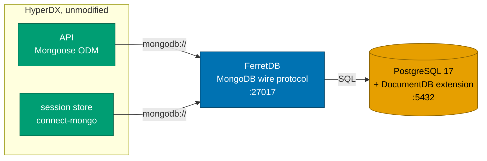
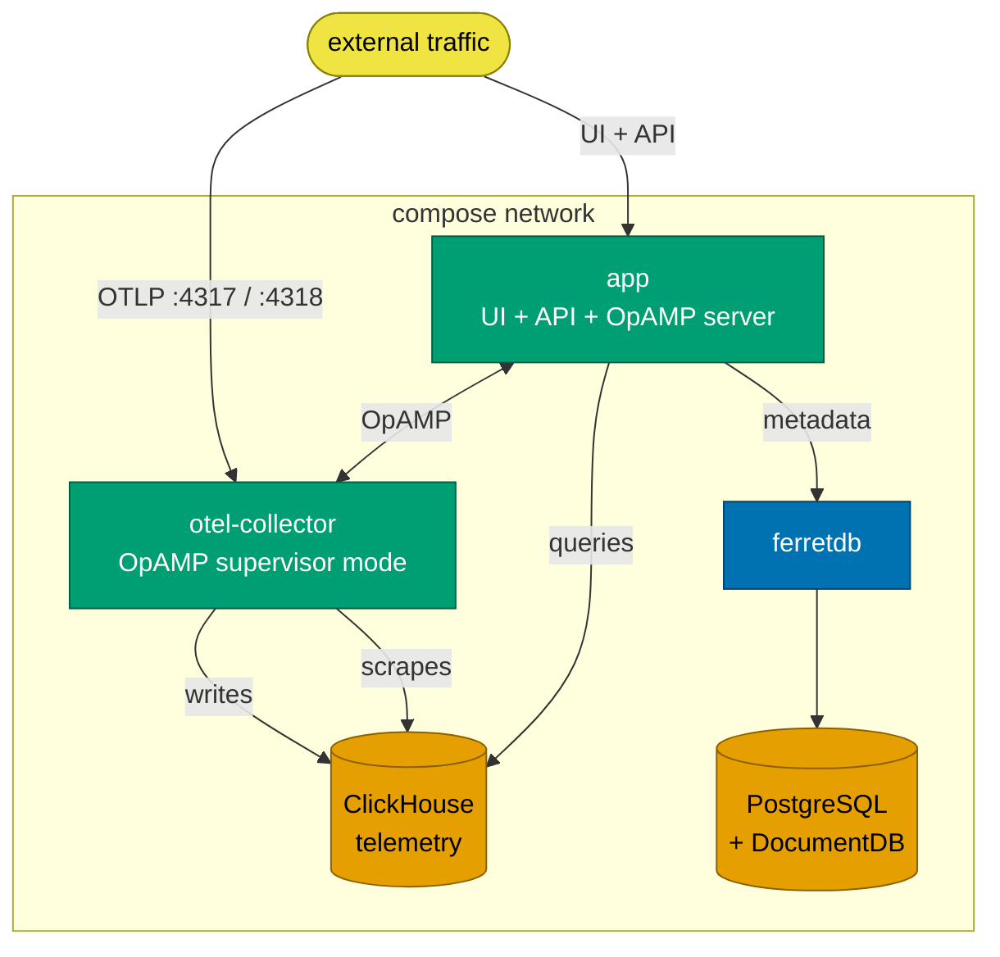

# Deployment

**MongoDB is replaced by FerretDB over PostgreSQL, and HyperDX does not know.**
Mongoose, `connect-mongo`, `passport-local-mongoose`, `migrate-mongo` and every
model and route work unchanged - `MONGO_URI` simply points somewhere else.

Why FerretDB rather than porting to SQL:
[ADR 0001](../decisions/0001-ferretdb-over-direct-postgres.md).

---

## The data layer

FerretDB implements the MongoDB 5.0+ wire protocol, so standard drivers and
tools (`mongosh`, Compass, `mongodump`) connect with an ordinary `mongodb://`
string. Documents land in PostgreSQL as BSON via the DocumentDB extension, which
brings PostgreSQL's backup, replication and monitoring ecosystem to data that
was previously Mongo's.

---

## Running it

The override is `docker-compose.dfe.yml`, which replaces the `db` service and
repoints the app. **Read that file for the current values** - reproducing them
here just creates a second copy to go stale.

Three things about it are worth knowing, because they are easy to get wrong:

- **`POSTGRES_DB` must be `postgres`.** DocumentDB requires it for `pg_cron`.
- **`MONGO_URI` needs `?authMechanism=PLAIN`.** FerretDB authenticates the
  PostgreSQL user through the Mongo protocol, and without this the driver
  negotiates SCRAM and fails.
- **The two images are a matched pair.** `postgres-documentdb` and `ferretdb`
  tags encode each other's version, and they are pinned together for that
  reason. FerretDB 2.x also **cannot be upgraded in place from 1.x** - it needs
  a clean install plus dump and restore.

Credentials come from the environment (`POSTGRES_USER`, `POSTGRES_PASSWORD`),
not from literals in the compose file.

---

## Service topology

The `app` container bundles the Next.js frontend and the Express API. The
collector runs in **OpAMP supervisor mode** - it takes its pipeline
configuration from the API at runtime rather than from a static file, which is
why the API is both a query server and a control plane.

Image tags and ports live in the compose files; see
[../development/docker-local.md](../development/docker-local.md) for running it
locally.

---

## What DFE adds on top

In the DFE platform this sits behind Envoy, which terminates OIDC - see
[oidc-authentication.md](oidc-authentication.md). Alerting is not started; the
DFE rules engine owns detection
([ADR 0002](../decisions/0002-alerting-disabled-for-dfe-rules.md)).
