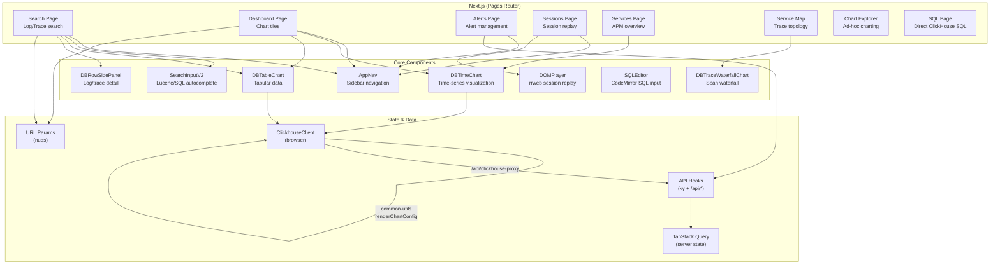

# Frontend

> **Scope.** This describes UPSTREAM HyperDX's architecture, which we do not
> modify. It is here so the fork's own docs are readable on their own;
> upstream's [`agent_docs/`](../../agent_docs/) is the authority, and anything
> specific to DFE is called out as such.

Key patterns:

- **URL-driven state**: All search filters, time ranges, and dashboard contexts
  are encoded in URL parameters (via `nuqs`), making every view deep-linkable
- **Server state**: TanStack Query manages all API data with custom hooks in
  `api.ts`, `dashboard.ts`, `savedSearch.ts`, `source.ts`, `sessions.ts`
- **Query engine in browser**: `renderChartConfig()` from `common-utils` runs
  client-side, generating parameterized SQL sent through the ClickHouse proxy
- **UI library**: Mantine components throughout, with Recharts and uPlot for
  charts, CodeMirror for SQL editing, and rrweb for session replay
