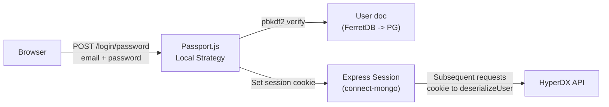
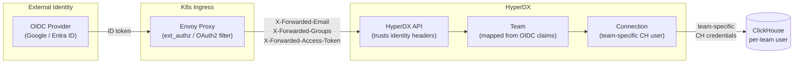
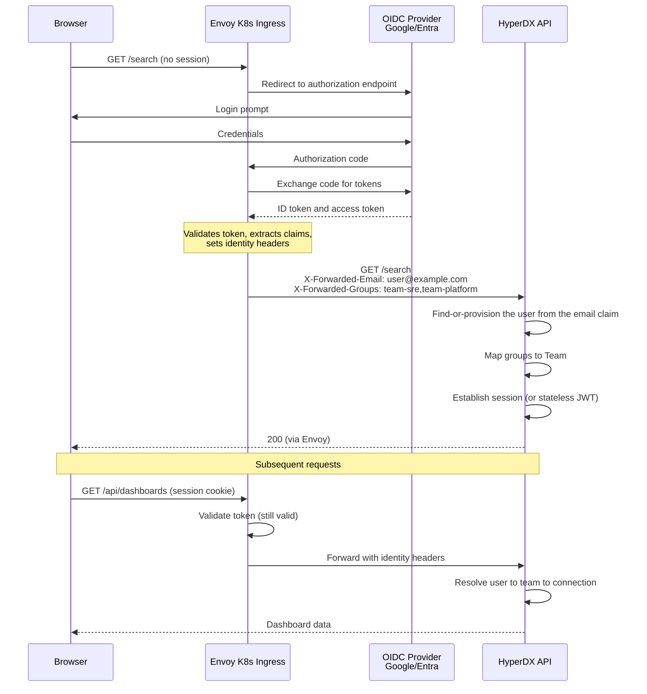

# OIDC authentication

> **Documentation status.** This page was carried over from the original
> embedding design and still reads in places as a PLAN ("changes required",
> "files to modify") rather than a description of what the code does today. The
> structure and diagrams have been corrected; the prose has not yet been
> re-verified against the code line by line. Treat a specific claim here as
> needing a check until this note is removed.

### Current Auth Model

HyperDX ships with a simple, single-tenant auth model:

Key characteristics:

- **Passport.js local strategy** - email + password, hashed with pbkdf2 via
  `@hyperdx/passport-local-mongoose` (a private fork)
- **Single-tenant** - `getTeam()` does `Team.findOne({})` with no ID filter; the
  entire deployment assumes exactly one team
- **No RBAC** - every user on the team has identical, full access
- **Session-based** - Express sessions stored in MongoDB (30-day rolling cookie)
- **Manual registration** - first user creates the team via
  `/register/password`, subsequent users join via invite tokens
  (`/team/setup/:token`)
- **`allowedAuthMethods`** - exists on the Team model but only supports
  `['password']`; no API route to configure it; enforcement is inside the
  passport-local-mongoose fork

### Target Auth Model

The authentication boundary moves **out of HyperDX entirely**. Envoy handles the
OIDC flow (authorization code grant, token validation, refresh). HyperDX
receives pre-authenticated identity via trusted headers and maps it to teams and
ClickHouse connections.

### Auth Flow with Envoy and OIDC

### Changes Required in HyperDX

All changes are scoped to `packages/api`. The frontend, common-utils, and OTel
collector are unaffected.

#### 1. New Auth Middleware: Trusted Header Authentication

Replace `isUserAuthenticated` with a new middleware that:

- Reads identity from headers set by Envoy (e.g. `X-Forwarded-Email`,
  `X-Forwarded-Groups`, or a validated JWT in `Authorization`)
- Finds or auto-creates the User document from the email claim
- Maps group claims to a Team (find-or-create by group name)
- Sets `req.user` with the resolved User + Team
- Falls back to existing session auth if headers are absent (for backwards
  compatibility or local dev)

**Files to modify:**

- `packages/api/src/middleware/auth.ts` - add `isExternalAuthenticated`
  middleware
- `packages/api/src/api-app.ts` - conditionally use the new middleware based on
  config (e.g. `AUTH_MODE=oidc-proxy`)

#### 2. User Auto-Provisioning

Replace the manual register + invite flow with just-in-time provisioning:

- On first request from a new email, create the User document
- Assign to Team based on OIDC group claims (configurable mapping)
- Run `setupTeamDefaults()` for newly created teams (connections + sources)
- No registration page, no invite tokens needed

**Files to modify:**

- `packages/api/src/controllers/user.ts` - add
  `findOrCreateUserFromOIDC(email, groups)`
- `packages/api/src/controllers/team.ts` - fix `getTeam()` to filter by ID (not
  just `findOne({})`) and add `findOrCreateTeamByName(groupName)`

#### 3. Multi-Tenancy Fix

The current `getTeam()` returns the first team found. For multi-team support:

- All team lookups must filter by `_id` or name
- The `getConnections()` controller bug (returns all connections unscoped) must
  be fixed to filter by team
- Verify all routes properly scope data access to `req.user.team`

**Files to modify:**

- `packages/api/src/controllers/team.ts` - `getTeam()` must accept and filter by
  ID
- `packages/api/src/controllers/connection.ts` - `getConnections()` must filter
  by team

#### 4. Team -> ClickHouse User Mapping

This already works - each Connection stores `username` + `password` scoped to a
Team. No code changes needed. Configuration-level: create a ClickHouse user per
team and configure each Team's Connection accordingly.

#### 5. Disable or Gate Legacy Auth Routes

The Passport.js login/register/invite routes should be disabled when running in
OIDC proxy mode to avoid confusion:

- `POST /login/password` - disabled
- `POST /register/password` - disabled
- `POST /team/setup/:token` - disabled
- `POST /team/invitation` - disabled

**Files to modify:**

- `packages/api/src/routers/api/root.ts` - gate routes behind `AUTH_MODE` config
- `packages/api/src/routers/api/team.ts` - gate invite routes

#### 6. Frontend Adjustments

Minimal changes - the frontend already redirects to `/search` when a session
exists:

- `LandingPage.tsx` - skip the register/login check when `AUTH_MODE=oidc-proxy`
  (Envoy will handle the redirect)
- `AuthPage.tsx` - hide or redirect (the login form is never shown; Envoy
  handles it)
- `TeamPage.tsx` - hide invite UI when running in OIDC mode

#### Summary of New Config

| Variable             | Value                | Purpose                                               |
| -------------------- | -------------------- | ----------------------------------------------------- |
| `AUTH_MODE`          | `oidc-proxy`         | Enables trusted header auth, disables Passport routes |
| `AUTH_HEADER_EMAIL`  | `X-Forwarded-Email`  | Header containing authenticated user's email          |
| `AUTH_HEADER_GROUPS` | `X-Forwarded-Groups` | Header containing comma-separated group/team claims   |
| `AUTH_DEFAULT_TEAM`  | (optional)           | Default team name if no group header is present       |
