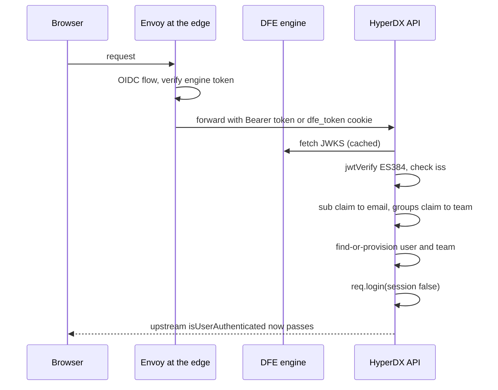
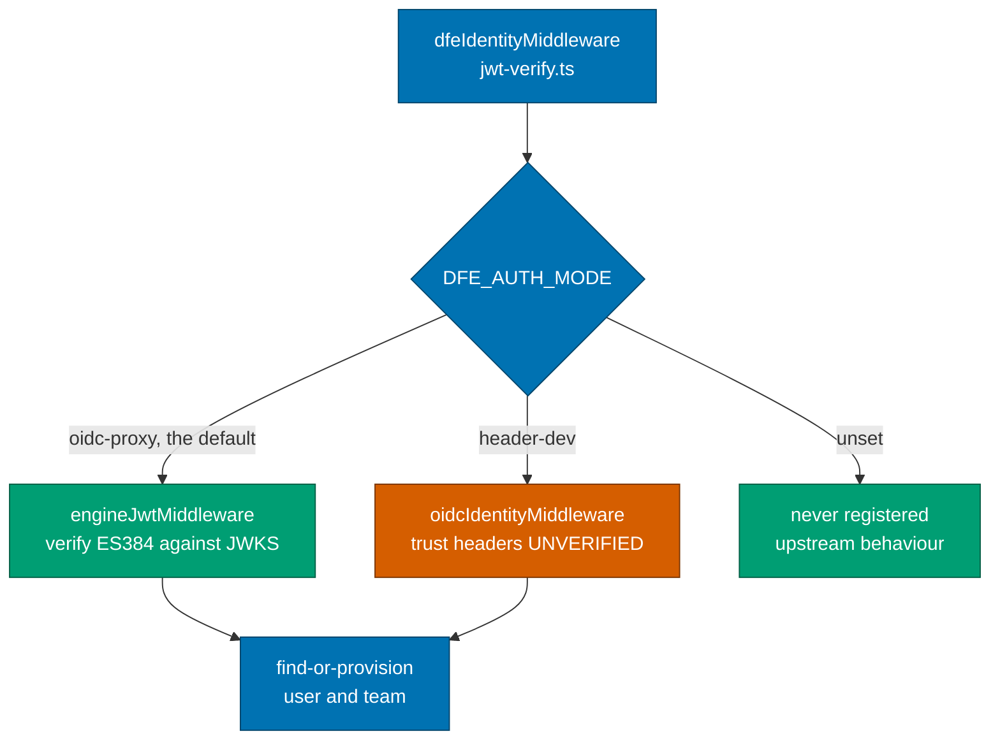

# OIDC authentication

**The DFE engine is the single JWT issuer. HyperDX verifies its token rather
than trusting a header.**

Envoy terminates OIDC at the edge and verifies the engine's ES384 token. HyperDX
verifies it _again_ against the engine's JWKS, because HyperDX is a policy
enforcement point and an unauthenticated header is not an identity.

None of this touches upstream's auth. It is one middleware registered ahead of
Passport, and with `DFE_AUTH_MODE` unset it is never registered at all - the
fork behaves exactly as upstream ships.

---

## The flow

Two things about that last step are worth knowing:

- **`req.login(..., { session: false })`** populates `req.user` exactly as
  Passport would, so every upstream route guard works unmodified. That is why
  the fork needs no changes to upstream's auth code.
- **A missing or invalid token falls THROUGH, it does not 401.** The route-level
  `isUserAuthenticated` guard is what rejects the request. Failing open here
  would be a hole; failing closed here would break upstream's own session login,
  which still has to work.

---

## Where the identity comes from

**`header-dev` is dev-only and trusts headers without any verification.** It
exists so local development works without a running engine. Anything that can
reach the API can assert any identity under it. Never set it in production.

### Token source

`Authorization: Bearer <token>` if present, otherwise a `dfe_token` cookie. The
cookie header is parsed directly rather than adding `cookie-parser`, to avoid a
dependency for one lookup.

### Claims

| Claim    | Used for                                                     |
| -------- | ------------------------------------------------------------ |
| `sub`    | the user's email; without it the request falls through       |
| `groups` | team name - accepts a JSON array or a comma-separated string |
| `iss`    | enforced when `DFE_ENGINE_ISSUER` is set                     |

Team resolution is the first group, else `DFE_AUTH_DEFAULT_TEAM`, else
`default`. Both the user and the team are find-or-create, so there is no
registration or invite step in DFE mode.

---

## Configuration

| Variable                 | Default              | Purpose                                                 |
| ------------------------ | -------------------- | ------------------------------------------------------- |
| `DFE_AUTH_MODE`          | unset                | `oidc-proxy`, `header-dev`, or unset for stock upstream |
| `DFE_ENGINE_JWKS_URL`    | -                    | engine JWKS; required in `oidc-proxy` mode              |
| `DFE_ENGINE_ISSUER`      | unset                | enforced as the `iss` claim when set                    |
| `DFE_AUTH_HEADER_EMAIL`  | `x-forwarded-email`  | `header-dev` only                                       |
| `DFE_AUTH_HEADER_GROUPS` | `x-forwarded-groups` | `header-dev` only                                       |
| `DFE_AUTH_DEFAULT_TEAM`  | unset                | team when no group claim is present                     |

Read in `packages/api/src/dfe/config.ts`; `isDfeEnabled` is what `api-app.ts`
gates the middleware registration on.

---

## The files

| File                                   | Role                                                |
| -------------------------------------- | --------------------------------------------------- |
| `dfe/middleware/jwt-verify.ts`         | entry point, mode switch, ES384 verification        |
| `dfe/middleware/oidc-identity.ts`      | the `header-dev` path                               |
| `dfe/controllers/user-provisioning.ts` | find-or-create the user                             |
| `dfe/controllers/team-provisioning.ts` | find-or-create the team                             |
| `dfe/config.ts`                        | the variables above                                 |
| `api-app.ts`                           | the one upstream file touched - a guarded `app.use` |

The JWKS resolver is built once and reused. `createRemoteJWKSet` does its own
fetch caching, coalescing and cooldown, so there is no key cache of ours to get
wrong.

---

## AI steering

| Don't                                             | Do                                                  | Why                                                                            |
| ------------------------------------------------- | --------------------------------------------------- | ------------------------------------------------------------------------------ |
| Trust `x-forwarded-email` in new code             | Read `req.user`, set by the middleware              | The header is only authoritative in `header-dev`, which is not production      |
| Return 401 from identity middleware               | Fall through and let `isUserAuthenticated` decide   | Upstream session login must keep working alongside DFE mode                    |
| Add auth logic to upstream's `middleware/auth.ts` | Add it under `dfe/` and register it in `api-app.ts` | Editing upstream's auth is permanent conflict surface, and the guard blocks it |
| Widen `algorithms` beyond `['ES384']`             | Leave it pinned                                     | Algorithm confusion is the classic JWT verification bug                        |
