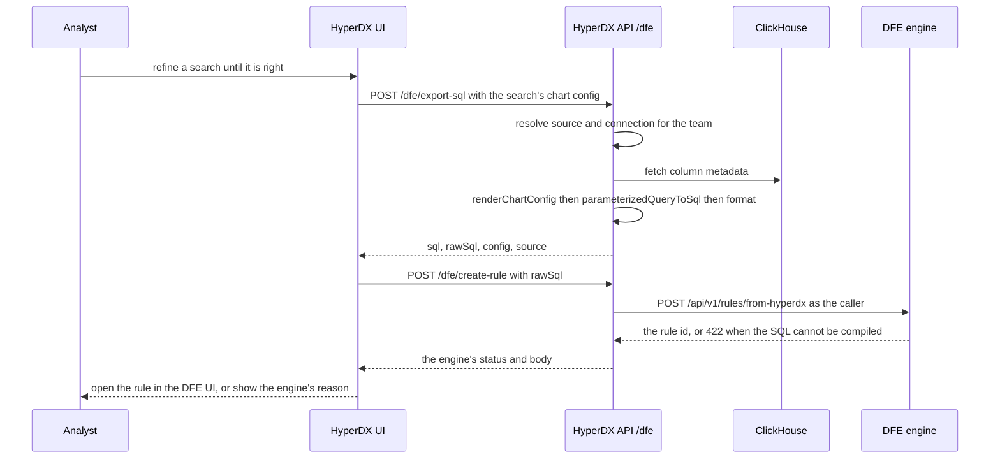

# Query-to-rule pipeline

**Turn a HyperDX search into a DFE detection rule without retyping it.** An
analyst who has already found the thing in HyperDX presses a button; the engine
gets the SQL that search runs and saves it as a rule a hunt can use.

Two routes (`POST /dfe/export-sql`, `POST /dfe/create-rule`) and one button, all
under `dfe/` - no upstream file is modified.

---

## The path

---

## What the export renders

`packages/api/src/dfe/routers/query-export.ts`, mounted at `/dfe` behind
upstream's `isUserAuthenticated`.

**Request** - `chartConfig` (the same `SavedChartConfig` shape a dashboard tile
uses), plus optional `startTime` / `endTime` in milliseconds.

**Response**

| Field    | What it is                                            |
| -------- | ----------------------------------------------------- |
| `sql`    | formatted, executable SQL                             |
| `rawSql` | the same query unformatted                            |
| `config` | the original chart config, for structured consumption |
| `source` | `{ name, kind, from, connection }`                    |

The query is the one the search runs. `from` is the source's own table, and the
search bar, its language and every side-panel filter reach `renderChartConfig`
as the view holds them, so the renderer that runs the search also writes the
rule. The engine reads the `FROM` as the table the hunt scans and the `WHERE` as
the detection logic.

There is no time bound. The saved chart config carries no
`timestampValueExpression`, so the renderer emits none, and the hunt runner
supplies its own window. The engine strips the display-only rest (`LIMIT`,
`SETTINGS`, time buckets).

The engine expands no placeholder. A templated table such as
`{{org_id}}.{{source_table_name}}` or a `{timestamp_condition}` does not parse,
and the engine refuses a rule it cannot compile with 422 and saves nothing.

### Rendering

`renderChartConfig` (needs ClickHouse column metadata, hence the client), then
`parameterizedQueryToSql`, then `format`. **A formatting failure is not
fatal** - it falls back to the raw SQL, because a valid query that reads badly
beats no query at all.

---

## The button

`packages/app/src/dfe/components/CreateRuleFromSearch/` exports the search,
posts the `rawSql` to `/dfe/create-rule`, and opens the created rule at
`DFE_UI_BASE_URL/rules/<id>`. A refusal shows the engine's own reason.

It deliberately uses plain `useState` rather than react-query's `useMutation`.
The component is injected into upstream's `DBSearchPage`, and upstream's own
tests render that page behind a _partial_ `@tanstack/react-query` mock - pulling
a second hook out of that module makes their pristine tests explode. Our delta
has to stay invisible to upstream's test suite.

---

## Version sensitivity

Two things moved in 2.29 and the code guards for both:

- `SavedChartConfig` became a **union**, so `chartConfig.source` is optional and
  `where` only exists on the builder variant. Both are checked before use.
- `source.connection` is a **connection-id string**, not a populated object.

Neither guard is decorative; removing either produces a runtime failure on some
chart types only.

---

## AI steering

| Don't                                            | Do                                        | Why                                                        |
| ------------------------------------------------ | ----------------------------------------- | ---------------------------------------------------------- |
| Assume `chartConfig.where` exists                | Check `'where' in chartConfig` first      | It is a union; raw-SQL and PromQL variants have no `where` |
| Swap the table or the time filter for a template | Render against `source.from` as it stands | The engine expands no placeholder and refuses the rule     |
| Rewrite the search into SQL by hand              | Let `renderChartConfig` render it         | The search page runs the same renderer                     |
| Add a react-query hook to this component         | Use plain state                           | Upstream's partial mock of that module breaks their tests  |
