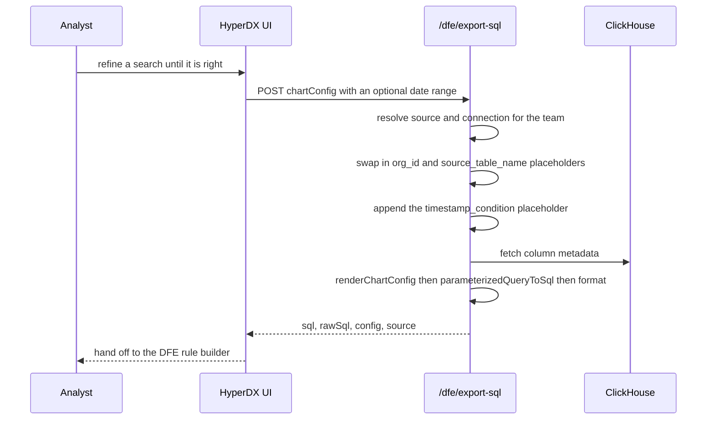

# Query-to-rule pipeline

**Turn a HyperDX search into a DFE detection rule without retyping it.** An
analyst who has already found the thing in HyperDX presses a button; the engine
gets executable SQL with the tenant and table left as placeholders.

One route (`POST /dfe/export-sql`) and one button, both under `dfe/` - no
upstream file is modified.

---

## The path



---

## What the endpoint actually does

`packages/api/src/dfe/routers/query-export.ts`, mounted at `/dfe` behind
upstream's `isUserAuthenticated`.

**Request** - `chartConfig` (the same `SavedChartConfig` shape a dashboard tile
uses), plus optional `startTime` / `endTime` in milliseconds.

**Response**

| Field    | What it is                                            |
| -------- | ----------------------------------------------------- |
| `sql`    | formatted, executable SQL                             |
| `rawSql` | the same query unformatted                            |
| `config` | the original chart config, for structured consumption |
| `source` | `{ name, kind, from, connection }`                    |

### The placeholder rewrite is the interesting part

The rendered SQL is not meant to run as-is in HyperDX - it runs in the DFE
control plane, against whichever tenant and table the rule is later bound to. So
before rendering, three substitutions happen:

```
from.databaseName  ->  {{org_id}}
from.tableName     ->  {{source_table_name}}
where              ->  <original where> AND {timestamp_condition}
```

With no original `where`, the clause becomes `{timestamp_condition}` alone -
**and `whereLanguage` is forced to `sql`.** That is not cosmetic. The default
Lucene parser reads `{a TO b}` as range syntax, so it chokes on
`{timestamp_condition}` and the export fails. Forcing SQL mode skips the Lucene
pass entirely.

### Rendering

`renderChartConfig` (needs ClickHouse column metadata, hence the client), then
`parameterizedQueryToSql`, then `format`. **A formatting failure is not
fatal** - it falls back to the raw SQL, because a valid query that reads badly
beats no query at all.

---

## The button

`packages/app/src/dfe/components/CreateRuleFromSearch/` posts to the endpoint
and hands the result to the DFE UI's rule builder at `DFE_UI_BASE_URL`.

It deliberately uses plain `useState` rather than react-query's `useMutation`.
The component is injected into upstream's `DBSearchPage`, and upstream's own
tests render that page behind a _partial_ `@tanstack/react-query` mock - pulling
a second hook out of that module makes their pristine tests explode. Our delta
has to stay invisible to upstream's test suite.

---

## Version sensitivity

Two things moved in 2.29 and the code guards for both:

- `SavedChartConfig` became a **union**, so `chartConfig.source` is optional and
  `where` only exists on the builder variant. Both are checked before use.
- `source.connection` is a **connection-id string**, not a populated object.

Neither guard is decorative; removing either produces a runtime failure on some
chart types only.

---

## AI steering

| Don't                                    | Do                                                            | Why                                                        |
| ---------------------------------------- | ------------------------------------------------------------- | ---------------------------------------------------------- |
| Assume `chartConfig.where` exists        | Check `'where' in chartConfig` first                          | It is a union; raw-SQL and PromQL variants have no `where` |
| Drop the `whereLanguage: 'sql'` branch   | Keep it for the empty-`where` case                            | The Lucene parser fails on `{timestamp_condition}`         |
| Hardcode a database or table name        | Leave the `{{org_id}}` / `{{source_table_name}}` placeholders | The rule is bound to a tenant later, not here              |
| Add a react-query hook to this component | Use plain state                                               | Upstream's partial mock of that module breaks their tests  |
