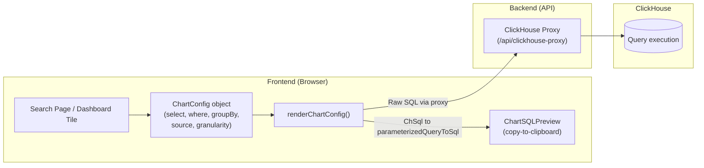
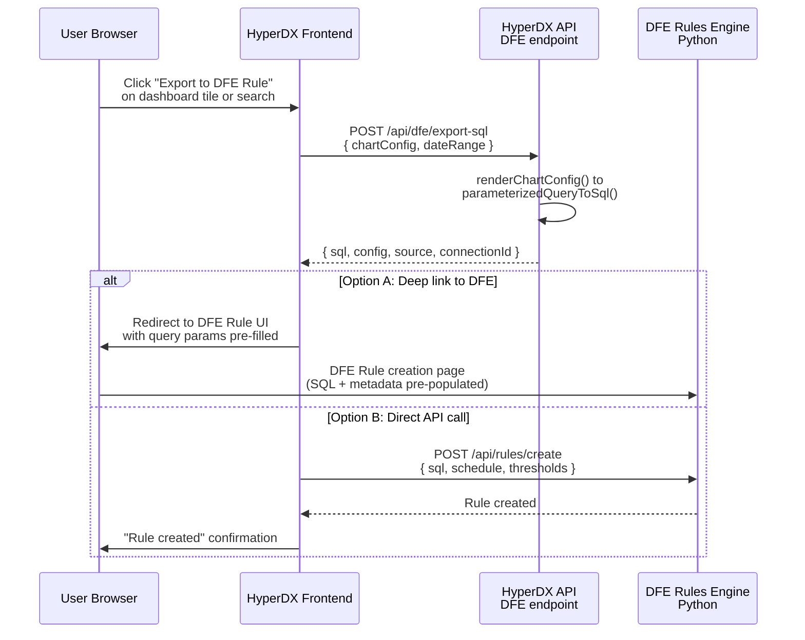

# Query-to-rule pipeline

> **Documentation status.** This page was carried over from the original
> embedding design and still reads in places as a PLAN ("changes required",
> "files to modify") rather than a description of what the code does today. The
> structure and diagrams have been corrected; the prose has not yet been
> re-verified against the code line by line. Treat a specific claim here as
> needing a check until this note is removed.

A key DFE workflow: a user is exploring data in HyperDX (search page or
dashboard chart), finds something interesting, and wants to turn that query into
a DFE Rule that runs continuously. This section documents the query architecture
and the integration points Kay can use to build this flow.

### HyperDX Query Architecture

HyperDX stores queries as **structured config objects**, not raw SQL. SQL is
generated on-the-fly from these configs at render time.



The key types in the pipeline:

| Type                          | Location                                     | Purpose                                                                     |
| ----------------------------- | -------------------------------------------- | --------------------------------------------------------------------------- |
| `SavedChartConfig`            | `common-utils/src/types.ts`                  | Stored config for a dashboard tile (source, select, where, groupBy, etc.)   |
| `ChartConfigWithOptDateRange` | `common-utils/src/types.ts`                  | Runtime config with optional date range appended                            |
| `SavedSearch`                 | `api/src/models/savedSearch.ts`              | Persisted query with source, select, where, whereLanguage, orderBy, filters |
| `ChSql`                       | `common-utils/src/clickhouse/index.ts`       | Parameterized SQL template (`{ sql, params }`)                              |
| `renderChartConfig()`         | `common-utils/src/core/renderChartConfig.ts` | Converts config -> `ChSql` (the SQL generation engine)                      |
| `parameterizedQueryToSql()`   | `common-utils/src/clickhouse/index.ts`       | Fills parameters into `ChSql` -> executable SQL string                      |

### Extraction Points for DFE Rules

There are three natural places to extract queries for DFE rules:

#### 1. Dashboard Tile Config (Structured)

Each dashboard tile stores a `SavedChartConfig` in MongoDB (via FerretDB). This
is the richest extraction point - it contains the full query definition
including aggregation functions, group-by clauses, and filters.

```typescript
// A dashboard tile's config (from GET /api/dashboards/:id)
{
  source: "6789abcdef012345",      // Source ID -> maps to a CH table
  displayType: "line",
  select: [
    { aggFn: "count", valueExpression: "", alias: "error_count" },
  ],
  where: "SeverityText:error AND ServiceName:api-gateway",
  whereLanguage: "lucene",
  groupBy: [{ valueExpression: "ServiceName" }],
  granularity: "5m",
  // ... filters, having, orderBy, etc.
}
```

**Advantage**: Structured, machine-readable, includes aggregation semantics. The
DFE rule engine can interpret the config directly without parsing SQL.

#### 2. Saved Search Config (Structured)

Saved searches store a similar structure (source, select, where, orderBy,
filters). Available via `GET /api/saved-search`.

```typescript
// A saved search (from GET /api/saved-search)
{
  name: "API Gateway Errors",
  source: "6789abcdef012345",
  select: "Timestamp, SeverityText, Body",
  where: "SeverityText:error AND ServiceName:api-gateway",
  whereLanguage: "lucene",
  orderBy: "Timestamp DESC",
  filters: [],
}
```

**Advantage**: Simpler structure, user-named, already represents a "query worth
saving". Natural starting point for a rule.

#### 3. Rendered SQL (Raw)

The SQL that ClickHouse actually executes. Can be obtained by calling
`renderChartConfig()` + `parameterizedQueryToSql()` on any config. The frontend
already does this for the `ChartSQLPreview` component and has a copy button.

```sql
-- Rendered SQL from a dashboard tile
SELECT
  toStartOfInterval(TimestampTime, INTERVAL 300 SECOND) AS ts_bucket,
  ServiceName,
  count() AS error_count
FROM otel_logs
WHERE TimestampTime >= '2025-01-01 00:00:00'
  AND TimestampTime < '2025-01-02 00:00:00'
  AND hasToken(SeverityText, 'error')
  AND ServiceName = 'api-gateway'
GROUP BY ts_bucket, ServiceName
ORDER BY ts_bucket ASC
```

**Advantage**: Directly executable by the DFE Python rule engine against
ClickHouse (using the same team-scoped CH credentials). No translation needed.

### Recommended Approach: API Endpoint for SQL Extraction

Add a new DFE endpoint that accepts a chart config or saved search ID and
returns the rendered SQL. This is additive (new file in `dfe/`) and the
rendering logic already exists in `@hyperdx/common-utils`.

```typescript
// packages/api/src/dfe/routers/query-export.ts (NEW file)

import { renderChartConfig } from '@hyperdx/common-utils/dist/core/renderChartConfig';
import { parameterizedQueryToSql } from '@hyperdx/common-utils/dist/clickhouse';
import { getMetadata } from '@hyperdx/common-utils/dist/core/metadata';
import { format } from '@hyperdx/common-utils/dist/sqlFormatter';

router.post('/dfe/export-sql', async (req, res) => {
  const { teamId } = getNonNullUserWithTeam(req);
  const { chartConfig, savedSearchId, dateRange } = req.body;

  // Option A: Render from inline chart config
  // Option B: Load saved search by ID and build config from it

  const config = chartConfig ?? buildConfigFromSavedSearch(savedSearchId);
  const metadata = await getMetadata(clickhouseClient, source);
  const chSql = await renderChartConfig(config, metadata, querySettings);
  const sql = format(parameterizedQueryToSql(chSql));

  return res.json({
    sql, // Formatted, executable SQL
    config, // Original structured config (for DFE to interpret)
    source: {
      // Source metadata for CH connection mapping
      name: source.name,
      kind: source.kind,
      tableName: source.from.tableName,
    },
    connectionId: source.connection, // CH connection for this team
  });
});
```

This endpoint:

- Uses the exact same `renderChartConfig()` pipeline that HyperDX uses
  internally - the SQL is identical to what the user saw
- Returns both the structured config AND the rendered SQL - the DFE rule engine
  can use whichever is more convenient
- Includes source metadata so the DFE side knows which CH table and connection
  to target
- Is fully additive - new file in `dfe/routers/`, wired via the conditional
  block in `api-app.ts`

### Frontend: Export to DFE Rule Button

The user-facing flow adds an "Export to DFE Rule" action in the HyperDX UI that
sends the current query to the DFE rules system.



Two implementation options:

#### Option A: Deep Link (Simpler, Recommended for v1)

The HyperDX button constructs a URL to the DFE Rule creation page with the SQL
and metadata encoded as query parameters. The DFE UI pre-populates the rule
form. No cross-service API calls needed.

```text
https://dfe.example.com/rules/new?
  sql=SELECT+count()+AS+error_count+FROM+otel_logs+WHERE+...
  &table=otel_logs
  &connection=team-sre
  &name=API+Gateway+Errors
```

#### Option B: Direct Integration (More Seamless)

The HyperDX frontend calls the DFE rules API directly (through Envoy, sharing
the same OIDC session) to create the rule in one click. Requires the DFE rules
API to accept a SQL-based rule definition.

#### Frontend Implementation

For the "Export to DFE Rule" button, two approaches depending on how much
frontend change is acceptable:

#### Approach 1: Additive Only (Zero Upstream File Changes)

Add a browser extension, bookmarklet, or DFE wrapper UI that reads the current
HyperDX page URL (which contains the full query state in URL parameters) and
extracts the query. The search page URL contains:

```text
/search?source=...&where=...&whereLanguage=...&select=...&orderBy=...
```

This is fully self-contained - the DFE wrapper parses the URL params and calls
the export endpoint.

#### Approach 2: Minimal Upstream Change (1-2 Files)

Add an "Export to DFE Rule" menu item to the existing chart context menu
(`DBDashboardPage.tsx`) and search results toolbar (`DBSearchPage.tsx`). These
are small UI additions (a menu item in an existing dropdown) that call the DFE
export endpoint.

Since these are in rendering code (not structural), upstream merge conflicts are
unlikely. The same `DFE START / DFE END` comment pattern keeps changes
identifiable.

### DFE Rule Engine Consumption

The DFE Python rules engine receives the exported SQL and can use it directly:

```python
# DFE Rule definition (Python side)
class Rule:
    name: str
    sql_template: str       # From HyperDX export, with date placeholders
    schedule: str           # cron expression (e.g., "*/5 * * * *")
    threshold: float
    threshold_type: str     # "above" or "below"
    ch_connection: str      # ClickHouse connection name (team-scoped)

    def evaluate(self, ch_client):
        # Replace date range placeholders with current window
        sql = self.sql_template.replace(
            "{START_TIME}", self.window_start()
        ).replace(
            "{END_TIME}", self.window_end()
        )
        result = ch_client.query(sql)
        return self.check_threshold(result)
```

The exported SQL from HyperDX uses hardcoded date ranges (from the user's
current view). The DFE rule engine needs to parameterise the timestamp filters
to make the query recurring. Two strategies:

1. **SQL rewriting** - parse the SQL and replace timestamp literals with
   placeholders. Straightforward since HyperDX always generates timestamp
   filters in a predictable pattern
   (`TimestampTime >= '...' AND TimestampTime < '...'`)

2. **Config-based** - use the structured `ChartConfig` instead of raw SQL. The
   config includes `granularity` and the date range is a separate field, so the
   DFE engine can call `renderChartConfig()` itself (if using a Node.js sidecar)
   or build SQL from the structured fields directly

The structured config approach is more robust for long-term maintenance, but the
SQL rewriting approach is simpler to implement initially and doesn't require the
Python side to understand HyperDX's config schema.
