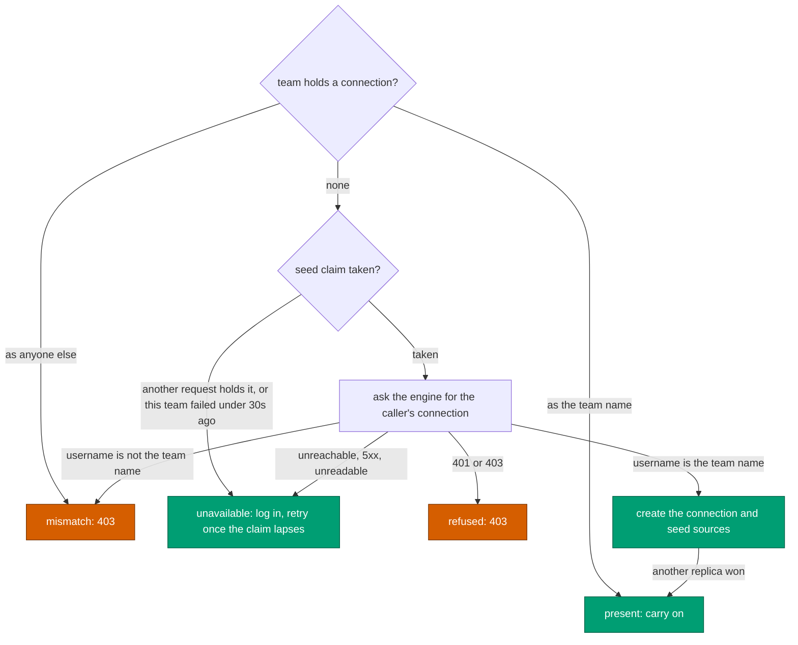

# Team identity

**A HyperDX team is the ClickHouse user its members read as.**

The engine hands every session one ClickHouse identity: `dfe_query_reader` for a
caller holding `query:execute` at system scope through a role other than
`org_viewer`, else `dfe_org_<org>` for a caller that resolves to exactly one
org. The team is named after that username, so there is one team per org plus
one platform team, and two users share a team only when the engine gives them
the same identity.

---

## The rule

- `GET /api/v1/auth/me` answers `hyperdx_identity`, the username
  `GET /api/v1/hyperdx/connection` hands the same caller, without its password.
  `dfe/controllers/engine-session.ts` names the team after it.
- An empty `hyperdx_identity` is a refusal (403). That is a caller with no
  `query:execute`, or one spanning several orgs.
- An engine that sends no `hyperdx_identity` is asked the connection read
  instead, and only its `username` is kept.
- The answer is cached per token for 30 seconds, never past the token's `exp`. A
  group change reaches HyperDX in that window.
- The dashboard role comes from the same answer: `hyperdx_role`, falling back to
  the token's `role` claim when the engine sends none. See
  [oidc-authentication.md](oidc-authentication.md).

## Seeding the connection

`dfe/controllers/org-connection.ts` runs on every request, after the user is
placed on the team.



- A connection is created only as the team's own name, so a platform admin
  arriving first on an org team cannot seed it with the platform reader.
- The `dfe_one_connection_per_team` unique index on `connections.team` makes a
  seed racing on another replica fail with a duplicate key, which reads as
  `present`. It is ensured from the dfe layer in `oidc-proxy` mode only;
  `header-dev` and upstream seed several `DEFAULT_CONNECTIONS` onto one team.
- A team holding no connection is seeded whatever happened before, so a failed
  first seed or a connection since deleted is restored.
- `dfe/models/team-seed.ts` holds one claim per team, atomic across replicas. A
  login's parallel requests make one seeding attempt, and a failed attempt is
  retried once the 30-second claim lapses.

## The startup repair

Before this rule a team was named after the first of its members' IdP groups and
seeded from whichever member arrived first, so a group team could hold a
ClickHouse user wider than some of its members were handed.
`dfe/tasks/team-connection-repair.ts` runs once per process when Mongo connects,
in `oidc-proxy` mode only, and deletes every connection whose username is not
its team's name, orphans included.

- It never touches users or content. Members move onto their identity team on
  their next request (`placeUserOnTeam`).
- The old group team keeps its dashboards, saved searches, sources and alerts,
  without a connection. Its members no longer see that content once they move.
  Re-homing it is an operator decision.
- A failure is logged and not retried. Sessions stay fenced without it: each
  lands on its identity team, and one whose team holds any other ClickHouse user
  is refused.

Each deletion logs the team, the username and the member count, then each
emptied team's content:

```text
WARN  DFE: deleting a team connection that is not the team identity
      teamId: "6abb3e94a0702ad8a4b5265c"  team: "acme-team"  username: "dfe_query_reader"
      connectionId: "6abb3e94a0702ad8a4b52670"  members: 2
INFO  DFE: team left without a connection keeps its content
      teamId: "6abb3e94a0702ad8a4b5265c"  team: "acme-team"
      sources: 0  savedSearches: 0  dashboards: 1  alerts: 0
INFO  DFE: team connection repair complete
      checked: 3  deleted: 2
```

`team: null` is a connection whose team no longer exists.

## Evidence before the repair

Run these in `mongosh` against the HyperDX database before deploying the release
that carries the repair, and keep the output. They are read-only, and every
projection is an inclusion list, so `password` and the team `apiKey` are never
returned.

Connections whose username is not their team's name, the set the repair deletes:

```javascript
db.connections.aggregate([
  {
    $lookup: {
      from: 'teams',
      localField: 'team',
      foreignField: '_id',
      as: 't',
    },
  },
  { $project: { team: 1, username: 1, teamName: { $first: '$t.name' } } },
  { $match: { $expr: { $ne: ['$username', '$teamName'] } } },
]);
```

Who sat on each of those teams, and so could read as that username:

```javascript
db.users.find({ team: ObjectId('<teamId>') }, { email: 1, team: 1 });
```

Member count per team, and the teams themselves:

```javascript
db.users.aggregate([{ $group: { _id: '$team', members: { $sum: 1 } } }]);
db.teams.find({}, { name: 1 });
```

The sources on each team and the connection each one reads through:

```javascript
db.sources.find({}, { team: 1, name: 1, connection: 1 });
```

Content each team holds, per collection:

```javascript
['savedsearches', 'dashboards', 'alerts'].map(c => ({
  [c]: db
    .getCollection(c)
    .aggregate([{ $group: { _id: '$team', n: { $sum: 1 } } }])
    .toArray(),
}));
```
