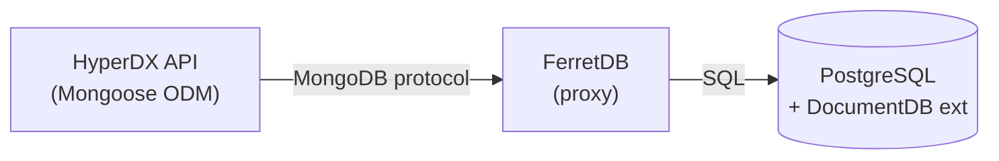
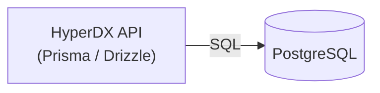
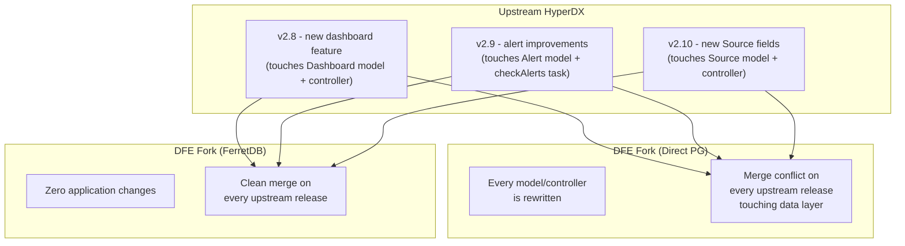

# FerretDB over a direct PostgreSQL migration

An assessment of the two approaches to removing the MongoDB dependency: using
FerretDB as a transparent proxy vs. migrating the application code to use
PostgreSQL directly.

### Option 1: FerretDB (Recommended)

FerretDB sits between HyperDX and PostgreSQL, translating the MongoDB wire
protocol to SQL. HyperDX application code is completely unchanged.

**Cost: Zero application changes**

| Factor                 | Assessment                                                            |
| ---------------------- | --------------------------------------------------------------------- |
| Code changes           | None - Mongoose, connect-mongo, passport-local-mongoose all work      |
| Testing effort         | Smoke test the existing suite against FerretDB                        |
| Risk                   | Low - FerretDB 2.x with DocumentDB extension is mature                |
| Upstream compatibility | Full - can pull upstream HyperDX updates without merge conflicts      |
| Operational overhead   | One extra container (FerretDB proxy), ~50MB RAM, stateless            |
| Performance            | Slight overhead from protocol translation; metadata workload is light |
| Data portability       | `mongodump`/`mongorestore` work through FerretDB for backup/migration |

**Key advantage: zero fork divergence.** Every upstream HyperDX release merges
cleanly because the application layer is identical. The only difference is the
Docker Compose infrastructure, which lives outside the application code.

### Option 2: Direct PostgreSQL Migration (Native)

Replace Mongoose with a PostgreSQL ORM (Prisma, Drizzle, or raw `pg`). Rewrite
all models, queries, and middleware to use SQL/PostgreSQL natively.

**Cost: Major fork with ongoing maintenance burden**

| Factor                 | Assessment                                                                      |
| ---------------------- | ------------------------------------------------------------------------------- |
| Code changes           | ~40+ files across models, controllers, routers, middleware, tasks, tests        |
| Testing effort         | Full rewrite of all integration tests; new test fixtures                        |
| Risk                   | High - subtle behavioral differences in query semantics, type coercion, etc.    |
| Upstream compatibility | **Broken** - every upstream HyperDX release touching MongoDB code will conflict |
| Operational overhead   | Simpler stack (no FerretDB proxy), one fewer container                          |
| Performance            | Slightly better (no translation layer), but metadata workload is trivial        |
| Data portability       | Standard PostgreSQL tooling (pg_dump, logical replication)                      |

#### Scope of a Direct Migration

To quantify the fork cost, here is what would need to change:

**Models (13 files)** - `packages/api/src/models/`:

- Rewrite all Mongoose schemas to PostgreSQL table definitions
- Replace `Schema.Types.ObjectId` refs with foreign keys
- Replace `Schema.Types.Mixed` (dashboard tiles, alert channels) with JSONB
  columns
- Replace `MongooseMap` (webhook headers/params) with JSONB
- Reimplement TTL indexes as scheduled cleanup jobs or PostgreSQL row expiry
- Replace `passport-local-mongoose` plugin with custom password hashing +
  Passport.js local strategy against PostgreSQL
- Replace `connect-mongo` session store with `connect-pg-simple`

**Controllers (8+ files)** - `packages/api/src/controllers/`:

- Rewrite all Mongoose queries (`.find()`, `.findOne()`, `.findOneAndUpdate()`,
  `.create()`, `.aggregate()`) to SQL
- The three aggregation pipelines are the most complex rewrites:
  - `controllers/team.ts` - tag extraction (`$unwind` + `$group`)
  - `controllers/alertHistory.ts` - alert history grouping (`$group` + `$push` +
    `$sum`)
  - `tasks/checkAlerts/index.ts` - latest alert state (`$group` + `$first` +
    `$$ROOT`)
- Replace `.populate()` calls with SQL JOINs

**Routers (10+ files)** - `packages/api/src/routers/`:

- Update all routes that construct Mongoose queries
- Replace MongoDB ObjectId validation with UUID or integer ID validation

**Tests (10+ files)** - all `__tests__/` directories:

- Replace MongoDB test fixtures with PostgreSQL setup/teardown
- Replace `mongooseConnection.dropDatabase()` with PostgreSQL equivalents
- Update CI Docker Compose to use PostgreSQL instead of MongoDB

**Migrations** - replace `migrate-mongo` with a PostgreSQL migration tool (e.g.
`node-pg-migrate`, Prisma Migrate, or Drizzle Kit)

**Dependencies** - remove `mongoose`, `mongodb`, `connect-mongo`,
`@hyperdx/passport-local-mongoose`, `migrate-mongo`; add PostgreSQL ORM +
driver + session store

#### The Fork Problem

This is the critical consideration. HyperDX is actively developed - the
changelog shows frequent releases. A direct PostgreSQL migration creates a
**hard fork** at the data layer:

With FerretDB, upstream merges are clean because nothing in the application
layer changes. With direct PostgreSQL, **every upstream release that touches a
model, controller, or test will require manual conflict resolution** - and the
data layer is the most frequently changed part of any application.

#### When Direct PostgreSQL Makes Sense

A direct migration would be justified if:

- HyperDX were a stable, rarely-updated dependency (it isn't - active
  development)
- The metadata workload were performance-critical (it isn't - light CRUD for
  config data; ClickHouse handles the heavy queries)
- FerretDB had significant compatibility gaps for this workload (it doesn't -
  HyperDX uses basic CRUD + three simple aggregation pipelines)
- You needed PostgreSQL-specific features in the metadata layer like full-text
  search, PostGIS, or advanced constraints (you don't)

### Recommendation

**Use FerretDB.** The engineering cost is zero, upstream compatibility is
preserved, and the metadata workload (users, teams, dashboards, alerts, saved
searches) is simple CRUD that FerretDB handles without issue. The one extra
container (~50MB RAM, stateless) is a trivially small cost compared to
maintaining a hard fork of the data layer across every upstream release.

Save the engineering effort for the OIDC auth integration, which is where the
real value lies and where the changes are scoped to a small, well-defined
surface area in the middleware and auth routes.
