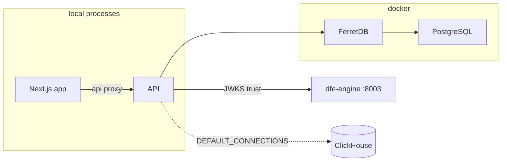

# DFE Development Guide

Quick reference for developing against the DFE fork of HyperDX.

## Prerequisites match upstream

See [CLAUDE.md](../../CLAUDE.md) for the full development setup. The DFE
differences are the compose invocation and one env file:

```bash
cp .env.dfe.example .env.dfe
```

`.env.dfe` is gitignored and required -- `yarn dev:dfe` fails without it. The
example carries working dev values; the FerretDB credentials are the only
required keys.

## Local dev: `yarn dev:dfe` runs the app locally on FerretDB

```bash
yarn dev:dfe
```

This starts FerretDB + PostgreSQL in Docker (replacing upstream MongoDB) and
runs the API and Next.js app as local processes. It does NOT start ClickHouse
or the otel collectors -- the DFE override scales them to zero because ingest
belongs to the DFE stack (dfe-docker or a local ClickHouse you point
`DEFAULT_CONNECTIONS` at, in `.env.dfe`). The collectors are never built
either: the override pins the prebuilt image, so there is no from-source
collector compile.



Ports are FIXED under `dev:dfe`: API 8000, app 8080, FerretDB 27017 (published
on all interfaces), from `.env` defaults -- the per-worktree port slots and the
:9900 dev portal belong to upstream `yarn dev`, not this flow, so two
`dev:dfe` checkouts collide. To retarget by hand: the API and the app BOTH
read `PORT`, so run them as separate processes with distinct `PORT` values and
set `HYPERDX_API_PORT` so the app's `/api` proxy finds the API.

## Wiring against dfe-engine

`DFE_AUTH_MODE` in `.env.dfe` is the master switch: empty disables the DFE
identity layer entirely, `oidc-proxy` verifies engine-signed JWTs, and
`header-dev` trusts dev headers. With it enabled, the fork trusts the engine's
ES384 signing key over JWKS and the `/dfe/*` routes forward the caller's
`dfe_token` to the engine -- both settings also live in `.env.dfe`:

```
DFE_ENGINE_JWKS_URL=http://localhost:8003/.well-known/jwks.json
DFE_ENGINE_ISSUER=https://dfe.local/api
```

`engineOrigin()` derives the engine base URL from the JWKS URL, so no second
variable is needed. Verify the engine side is up before starting the fork:

```bash
curl -s http://localhost:8003/.well-known/jwks.json
# -> {"keys":[{"kty":"EC","crv":"P-384",...,"alg":"ES384",...}]}
```

The engine's own local boot is documented in
[dfe-engine docs/LOCAL-DEV.md](https://github.com/hyperi-io/dfe-engine/blob/main/docs/LOCAL-DEV.md).

## Production (all services in Docker)

```bash
docker compose -f docker-compose.yml -f docker-compose.dfe.yml up -d
```

The `app` service `MONGO_URI` is automatically overridden in
`docker-compose.dfe.yml`.

## All DFE work lands on main

The fork's default branch is the DFE branch and releases are cut from it.
Upstream syncs are covered in [docs/fork/sync-cycle.md](../fork/sync-cycle.md);
the full design (FerretDB, OIDC, additive-only strategy) is in
[the architecture docs](../architecture/README.md).

## FerretDB serves the MongoDB wire protocol

- The MongoDB DATA LAYER is unchanged: Mongoose, connect-mongo and
  passport-local-mongoose all work through FerretDB (the fork's additions
  live mainly under `packages/*/src/dfe/`, guarded by the conflict-surface
  check in `.github/workflows/fork-surface.yml`)
- FerretDB translates the wire protocol to SQL via PostgreSQL + DocumentDB
- Port 27017 matches upstream MongoDB, so the existing `MONGO_URI` in
  `.env.development` works as-is
- Images are pinned in `docker-compose.dfe.dev.yml`

## Where config lives

| File                            | Purpose                                   |
| ------------------------------- | ----------------------------------------- |
| `.env`                          | Upstream defaults (image versions, ports) |
| `.env.dfe.example`              | Template for `.env.dfe` -- copy first     |
| `.env.dfe`                      | DFE overrides (auth mode, engine, conns)  |
| `packages/api/.env.development` | Local API dev config                      |
| `docker-compose.dfe.dev.yml`    | DFE dev compose override (FerretDB, no CH)|
| `docker-compose.dfe.yml`        | DFE production compose override           |
