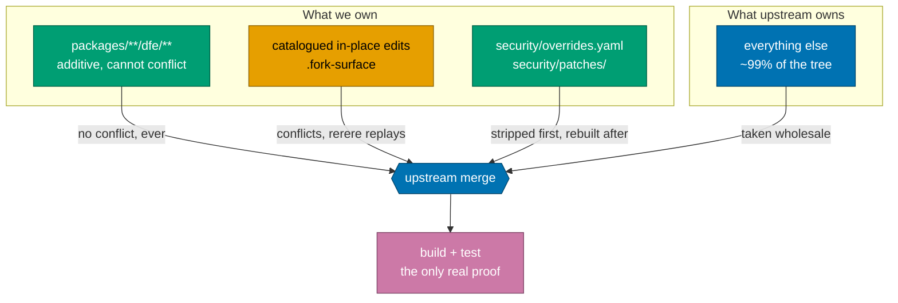

# The fork

`dfe-hyperdx` is a long-lived fork of
[hyperdxio/hyperdx](https://github.com/hyperdxio/hyperdx). We merge upstream
repeatedly, forever, and everything in these docs exists to keep that cheap.

**The governing rule: minimise what we change in anything that comes from
upstream.** Every edit to a pristine upstream file becomes permanent
merge-conflict surface. Getting it wrong does not fail loudly - it silently
makes every future sync more expensive, and the bill arrives months later for
whoever runs one.

---

## Start here

| You want to | Read |
| --- | --- |
| Know what we changed and why | [what-we-changed.md](what-we-changed.md) |
| Understand how the fork is held together | [design.md](design.md) |
| Run an upstream sync | [sync-cycle.md](sync-cycle.md) |
| Know how this ends | [leaving-upstream.md](leaving-upstream.md) |

---

## The shape of it, in one diagram



Only the orange box costs us anything on a sync. Keeping it small is the whole
game, and [design.md](design.md) is how.

---

## The four rules

1. **New code goes under a `dfe/` directory.** Those paths do not exist
   upstream, so they carry zero conflict risk. This is the default.
2. **Editing an upstream file in place is an EXCEPTION** - it must be
   identified, documented in [what-we-changed.md](what-we-changed.md), and
   listed in `.fork-surface` so the guard passes.
3. **Never bulk-reformat an upstream file.** A repo-wide formatter rewrites
   lines we do not own, which destroys rerere's ability to replay and makes
   every later sync a fresh hand-resolve.
4. **Never merge upstream onto `main` by hand.** The sync workflow does it on a
   bot branch and opens a PR.

Our files follow HyperI documentation standards. Upstream's files are left
exactly as they are, including their docs - `agent_docs/`, `AGENTS.md` and the
rest are theirs, and adding our conventions to them would be conflict surface
bought for nothing.

---

## The tooling

Run once per clone - rerere, the conflict-surface hook and the lockfile merge
driver are all per-clone git config, and a fresh clone starts unprotected:

```bash
./scripts/fork-setup.sh
```

| Command | Answers |
| --- | --- |
| `.githooks/fork-surface-check.py --drift` | Has upstream touched anything we hold a delta in? |
| `.githooks/fork-surface-check.py --audit` | What is catalogued that should not be? |
| `scripts/security-override.py --verify` | Does the tree match the security register? |
| `scripts/upstream-pin.py --show` | Which upstream are we built on? |
| `scripts/security-triage.py --audit` | What is newly vulnerable, and is it reachable? |

`--drift` is the one to run before starting work. It is the cheap moment to
shrink a delta, long before a merge turns it into a conflict.
