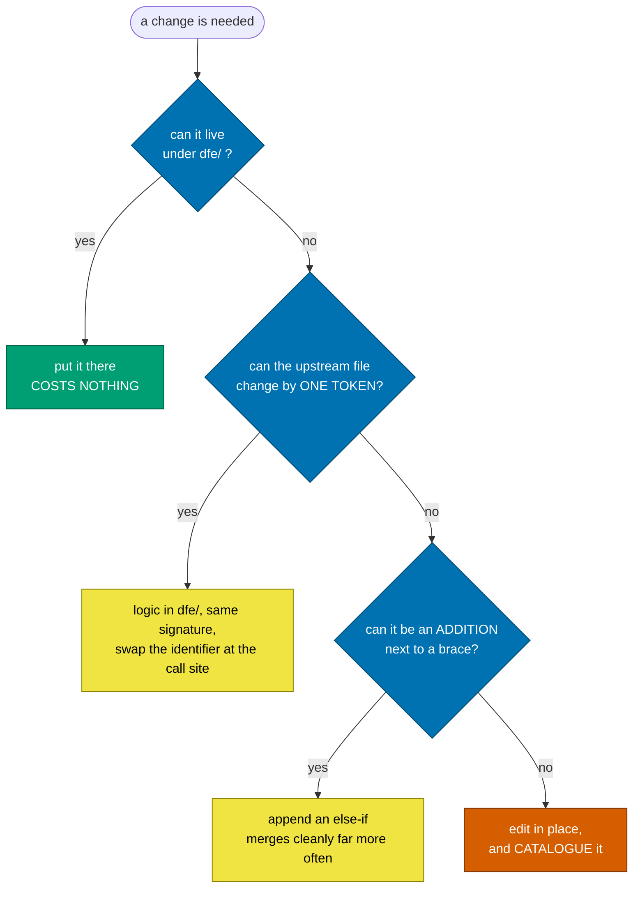

# How the fork is held together

Four mechanisms, each answering a different failure. Read the ladder first - it
is the one that changes what you type today.

---

## Three questions, before every change

Before the ladder, before anything:

1. **Do I really need it?**
2. **Can it be smaller and simpler?**
3. **Can it be done with less upstream drift risk?**

The governing goal of this fork is to MINIMISE the file-level variation from
upstream we have to maintain, while still carrying our changes, our
integrations, and the occasional security fix. Every question above serves that
one sentence.

It is pointed at models in particular, because they reliably fail it: given a
small brief they produce a large diff, since a large diff reads as effort. Here
it is not effort. A change touching no upstream file is free; a change touching
an upstream file is a bill paid at every future sync, by whoever runs it.

Applies to removal too. When a sync leaves one of our deltas identical to
upstream again, take it OFF `.fork-surface` - the file is pristine and the entry
now costs a check for nothing.

---

## The cheapest-edit ladder

**Before changing an upstream file, stop at the first option that fits.**

This is the single highest-leverage habit in the repo, and the one every model
gets wrong by default: the instinct is to open the upstream file and rewrite the
function body. That works, passes tests, and costs a hand-resolve on every sync
forever.



Rule 2 is the one worth internalising. Give your function the SAME SIGNATURE as
upstream's and swap the identifier at the call site: `foo(a, b, c)` becomes
`dfeFoo(a, b, c)`. The argument list stays byte-identical, so if upstream later
changes those arguments the conflict is trivial instead of structural.

### It is worth real money

A native-ClickHouse-JSON fix was first written the obvious way: rewrite
`buildJSONExtractQuery`'s body in `DBRowJsonViewer.tsx` and edit upstream's test
expectations. That is 53 insertions across the two files upstream churns hardest
in that area.

Redone as rule 2 (four call sites differing by one identifier) plus rule 3
(three `else if (isJsonColumn)` additions reusing upstream's own predicate):
**15 insertions**, `buildJSONExtractQuery` left byte-pristine, and the test file
back to pristine and off the catalogue entirely.

Same feature. A quarter of the standing cost, forever.

---

## Two lifetimes, two mechanisms

Everything in this fork is one of two things, and almost every mistake here
comes from treating them the same way.

| content                  | lifetime  | mechanism                                                   | conflict surface          |
| ------------------------ | --------- | ----------------------------------------------------------- | ------------------------- |
| our features + additions | PERMANENT | merged history, `dfe/` dirs, rerere, `.fork-surface`        | real, managed, catalogued |
| security dependency pins | TEMPORARY | generated into `resolutions` from `security/overrides.yaml` | none                      |
| security code fixes      | TEMPORARY | `security/patches/*.patch`, applied on top                  | none                      |

The permanent half is what rerere is for. The temporary half is what rerere
CANNOT do, and asking it to is the trap:

- Upstream uses `resolutions` for its OWN security pins - fourteen of them as of
  2.33.0, five of which moved between 2.29.0 and 2.33.0. Anything we add there
  lands in a block whose contents change every cycle, so a recorded conflict
  preimage never matches twice and rerere accumulates one-shot resolutions that
  never replay.
- `yarn.lock` is a megabyte of generated text. "Replay these hunks" is not a
  meaningful answer for a lockfile; "take upstream's and regenerate" is the only
  correct one, every time.

So the temporary layer is GENERATED, never merged - stripped before an upstream
merge and rebuilt after. That is what makes "undo our security fixes and try
again" a command rather than an afternoon. The procedure is
[sync-cycle.md](sync-cycle.md).

---

## The security posture is INVERTED here

The house standard is scanners-on, dependencies-current. In this repo that is
backwards, deliberately: **off by default, on only for what WE added.**

- `renovate.json` disables every manager and re-enables exactly one thing: the
  SHA-pinned actions in the workflows we own. Upstream's workflows are excluded
  BY NAME so a sync that adds one does not silently opt it in.
- CodeQL and GitHub code security are OFF, as are Dependabot's automatic fix
  PRs.
- Dependabot vulnerability ALERTS stay ON - they are the input to
  `scripts/security-triage.py`.
- gitleaks stays ON and blocking. It scans OUR commits for OUR secrets and has
  nothing to do with upstream's dependency tree.

**Why.** We do not own upstream's dependency tree. Patching a vendored dep
diverges us for a fix we did not write, converts a pristine file into permanent
rerere conflict surface, and gets re-conflicted on the next sync regardless.
Upstream patches upstream; we get it when we sync. And an alert queue full of
items nobody can action trains everyone to ignore the queue, including the one
that matters.

**What this does NOT mean.** Muting per-PR noise does not make an inherited CVE
unreal - the fork ships as a container image and those CVEs ship with it. The
image scan at publish still applies, and a critical finding there is an argument
for **syncing upstream now**, not for hand-patching a dependency we do not own.

### The exception: a reachable HIGH or CRITICAL

**Ask what the pending sync already clears, before triaging anything.** Alerts are
raised against the default branch, so an unmerged sync branch is invisible to
them. In August 2026, 51 of 136 open alerts were already answered by a sync
sitting in a PR -- including every `next` advisory, because 2.33.0 moved it from
16.1.7 to 16.2.11. Triaging that list first would have been most of a day spent
on items the merge closes, and any pin written for one is surface held forever
for nothing.

We do patch, but only when BOTH hold:

1. severity is **high or critical**, AND
2. there is a **real vector** - the vulnerable path is actually reachable in how
   DFE runs this fork.

Point 2 is the one that gets skipped, and it is the one that matters. Most
advisories against a transitive dependency are unreachable here: the package is
present but the vulnerable function is never imported, or it is only reachable
from a path we do not ship. **"npm audit says high" is not a vector.** If you
cannot write down how an attacker gets there, there is nothing to patch.

### Standing verdicts

Triaged 2026-08-05 against 136 open alerts. Kept by PACKAGE rather than by alert
number, because the numbers churn and the reasoning does not. Re-check a row only
when what pulls the package changes.

| package | pulled by | verdict |
| --- | --- | --- |
| `tar` | `node-gyp`, `cacache` | Install-time toolchain. Not in the shipped image, no request path. |
| `protobufjs` 6.x | `@hyperdx/otel-web-session-recorder` (`~6.11.2`) | Browser recorder, upstream's own package. A force to >=7.5.5 is a major bump across a pinned range. Upstream's to fix. |
| `systeminformation` | `@opentelemetry/host-metrics` | Command injection needs the attacker to already control host network config. Root range `^5.24.0` admits the fix, so any refresh clears it. |
| `@opentelemetry/*` | upstream's telemetry stack | 0.57 -> 0.217 is the otel-js renumbering. Forcing it breaks the stack; upstream carries it. |
| `ws` | `ink`, `jsdom`, `storybook` | Dev, test and CLI. Not the server's socket path. |
| `lodash` 4.17.x | `@stoplight/*`, `html-webpack-plugin` | Lint and build only. The workspaces themselves are already on 4.18.x. |
| `sharp` | `next` (`^0.34.5`) | Next's image optimiser, pinned by Next. Moves when Next moves. |
| `rollup`, `postcss`, `serialize-javascript`, `semver`, `minimatch`, `brace-expansion` | build toolchain | Build-time, processing our own sources. Nothing attacker-supplied reaches them. |
| `path-to-regexp` | `express` (`~0.1.12`) | The ReDoS needs attacker-controlled ROUTE DEFINITIONS. Ours are static. |
| `fast-uri` | `ajv` | Used for `$id`/`$ref` resolution. The schemas are ours, not user input. |
| `validator` | `z-schema` | Schema tooling, not request validation. |

**`ip-address` is the one worth reading.** It looks like the strongest candidate
on paper: `packages/api/src/utils/validators.ts` uses it to build `isPrivateIp()`,
the SSRF guard on user-configured webhook URLs, and the advisory is *precisely* an
SSRF bypass -- leading-zero octets decoded as decimal while the resolver decodes
them as octal. Advisory plus call site reads as an open-and-shut hit.

It is not reachable, and only a probe shows why. Both call sites pass
`new URL(host).hostname`, and the WHATWG URL parser normalises IPv4 hosts before
the guard sees them: `0177.0.0.1`, `0x7f.0.0.1` and `2130706433` all arrive as
`127.0.0.1` and are blocked, which is also what the socket layer does on connect.
The vulnerable decode never runs on a string an attacker chose the encoding of.

Two things follow. Reading the advisory against the call site would have produced
a pin that bought nothing and cost a check every sync -- **run the path before
believing it**. And if a caller is ever added that passes a raw string instead of
a parsed hostname, this row flips: `isPrivateIp` returns `false` for anything
`ip-address` cannot parse, so the fall-through is the thing to watch, not the
octet decoding.

### Code scanning: keep it all, sort it by who wrote the line

The muting above is the DEPENDENCY axis, where authorship is not a useful
question - the whole tree is upstream's regardless of who pulled a package in.

Code findings are different: they carry a file and a line, so they can be
attributed. `fork-security.yml` scans the whole tree and sorts the results:

- **OURS** - a line we added or changed versus the merge base. **Gates the
  build.**
- **ACCEPTED** - ours, reviewed, listed in `security/accepted.yaml` with a
  reason. Suppressed from the gate but PRINTED every run, because a suppression
  that has become wrong should be visible.
- **INHERITED** - upstream's lines. Reported, never gates.

Measured on a real run: 108 findings, 0 ours, 5 accepted, 103 inherited. Gating
on 108 is unworkable; muting 108 loses the ones that matter. Sorting is the only
answer that keeps both.

Attribution is `scripts/attribute-findings.py`, SARIF in, so it serves semgrep
and CodeQL alike. It compares **line content against the merge base**: a line we
added or changed is ours. That needs no catalogue and works even on an upstream
file nobody remembered to list.

---

## The squashed import, and the graft that repairs it

`e58f01d3 "Initial HyperDX commit"` is a FLATTENED copy of upstream, not a
continuation of their history, so git had no path from our tree back to theirs.
That broke two things: `git blame` attributed every upstream line to whoever ran
the import, and ancestry could not tell upstream code from ours.

The import was taken from upstream `fbeaf152`, and `scripts/fork-setup.sh`
reconnects them:

```bash
git replace --graft e58f01d3f4ede7b691ee4cf2873ad8548d93f210 fbeaf152...
```

**Non-destructive.** No object is rewritten and no SHA changes; `git replace -d`
undoes it. The merge base is unchanged, so the sync workflow, the drift report
and the attribution script all behave identically - blame and `git log` simply
stop lying.

It is per-clone config, applied by `fork-setup.sh` from the two recorded SHAs,
rather than a `refs/replace/*` ref that no clone fetches by default.

**What breaks it:** reformatting an upstream file rewrites every line into the
diff, so the whole file reads as ours and the signal is gone. That is a second,
independent reason for the no-bulk-reformat rule.

---

## Never put our assertions in an upstream test file

Upstream test files gain cases constantly and upstream has no stake in ours, so
a delta there is the most expensive kind for the least return. Ours live in a
`dfe/__tests__/` directory.

`.githooks/fork-surface-check.py --audit` lists the catalogued test files still
to migrate.
