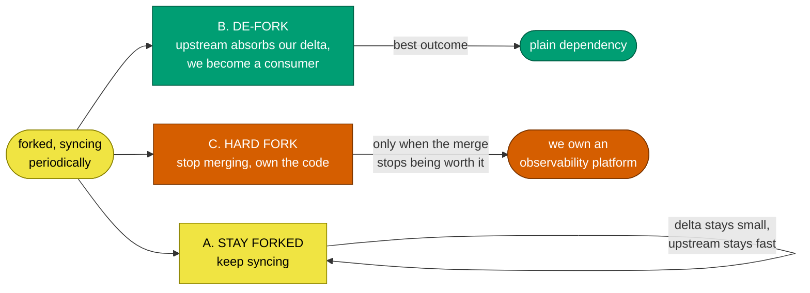

# Leaving the upstream dependency

**Forking is a position, not a destination.** The intent is to stop tracking
hyperdxio/hyperdx eventually - once HyperDX settles, or once we can allocate
enough resource to own the whole thing. This doc exists so that decision gets
made deliberately rather than drifted into.

---

## Three ways out

**A. Stay forked (today's position).** Cheapest while upstream moves fast and
our delta is small. The cost is a recurring sync, and the whole apparatus in
[design.md](design.md) exists to keep that cost roughly flat as upstream
accelerates.

**B. Upstream absorbs our delta, and we de-fork to a plain dependency.** The
best outcome, and not hypothetical. In 2.33.0 upstream added a "kiosk mode" that
hides the nav on dashboards - our embed feature arriving under a different name.
`packages/app/src/layout.tsx` now carries both conditions. Every time upstream
lands something we already hold, our delta shrinks and the case for B
strengthens. Getting there means raising our extensions upstream one at a time.

**C. Hard fork - stop merging, own the code.** The expensive one, and the
default we slide into by neglect rather than choose. Only right when our delta
is large enough that upstream's releases stop being worth the merge, and we have
the people to carry a full observability platform.

---

## Decide on evidence, not on fatigue after a bad sync

| Signal                            | Where to get it                                                                     | Argues for                                             |
| --------------------------------- | ----------------------------------------------------------------------------------- | ------------------------------------------------------ |
| Delta size and shape              | `.githooks/fork-surface-check.py --audit`, [what-we-changed.md](what-we-changed.md) | shrinking -> B; growing into upstream's hot files -> C |
| Sync cost over time               | the measurement table in [sync-cycle.md](sync-cycle.md)                             | rising despite the ladder -> C                         |
| Upstream velocity                 | `--drift` and the release cadence                                                   | slowing -> C cheaper, B less urgent                    |
| What we would lose                | the package table in [../architecture/README.md](../architecture/README.md)         | more we do not maintain -> A or B                      |
| Whether the delta is ours to keep | the catalogue                                                                       | branding and config evaporate under B                  |

---

## What a hard fork would actually cost

Not a rename. It means:

- **Taking ownership of the dependency tree.** Upstream currently patches it for
  us - fourteen pins in their `resolutions` block that we inherit for free.
- **Maintaining what we do not touch today** - the OTel collector build, the MCP
  server, the CLI, the eval harness.
- **Losing the delta gate's meaning.** Its whole job is proving an upstream
  change did not break us. With no upstream, it is just a test suite.

The security layer is the honest measure of that first cost. Every pin and patch
it carries is work upstream is currently doing that we would inherit
permanently. An empty `security/overrides.yaml` is the goal state precisely
because it means upstream is still carrying that load.

> **This is a human decision, taken once, with the numbers in front of us.** It
> is not an agent's call, and not something to conclude in the middle of a sync.
