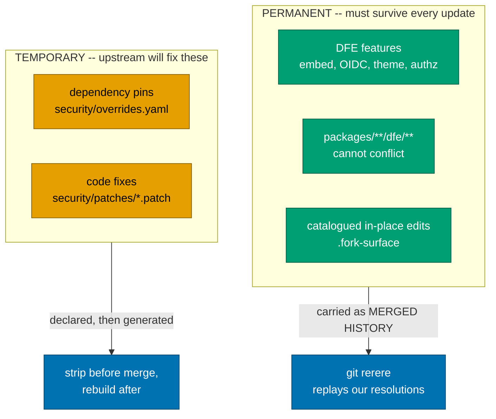
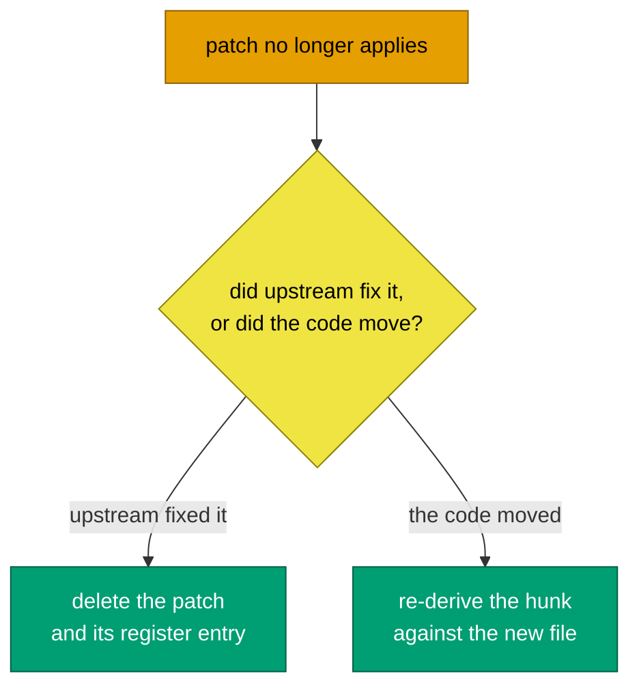

# Running an upstream sync

**The runbook.** How to move this fork onto a newer upstream HyperDX and keep
our security fixes correct while doing it.

Why the fork is shaped this way is [design.md](design.md); the catalogue of what
we changed is [what-we-changed.md](what-we-changed.md). This file is the
procedure.

---

## The one idea

The fork holds two kinds of content, and they need opposite treatment.



Our features are permanent, so they belong in merged history where rerere can
replay their conflict resolutions. Security fixes are temporary by design:
upstream ships their own within weeks. Committing one in place puts a delta we
expect to DELETE onto the permanent conflict surface, and it lands in
`package.json`'s `resolutions` block and `yarn.lock` -- the two files upstream
churns hardest.

rerere cannot help with the temporary half and must not be asked to. The
resolutions block changes contents every cycle, so a recorded conflict preimage
never matches twice. A lockfile has no meaningful "replay these hunks" answer at
all.

So the temporary layer is GENERATED. `security/overrides.yaml` and
`security/patches/` are the source; the tree is derived from them.

---

## The cycle

`.github/workflows/upstream-sync.yml` runs this weekly and on demand, and opens
a PR. Run it by hand when you want to drive a specific upstream tag.

```mermaid
flowchart LR
    strip["1. --unapply<br/>strip the layer"] --> merge["2. git merge<br/>rerere replays"]
    merge --> apply["3. --apply<br/>rebuild the layer"]
    apply --> pin["4. --set<br/>move the pin"]
    pin --> install["5. yarn install<br/>re-derive the lock"]
    install --> verify["6. --verify<br/>the invariants"]
    verify --> gate["7. build + test<br/>THE GUARANTEE"]
    gate --> triage["8. triage<br/>drafted for a human"]

    classDef layer fill:#E69F00,stroke:#8a6100,color:#000000
    classDef git fill:#0072B2,stroke:#00456b,color:#ffffff
    classDef check fill:#009E73,stroke:#005f45,color:#ffffff
    class strip,apply,pin layer
    class merge,install git
    class verify,gate,triage check
```



```bash
git switch -c sync/upstream-2.34.0 main
scripts/security-override.py --unapply        # 1
git merge '@hyperdx/app@2.34.0'               # 2
scripts/security-override.py --apply          # 3
scripts/upstream-pin.py --set '@hyperdx/app@2.34.0'   # 4
yarn install                                  # 5
scripts/security-override.py --verify         # 6
scripts/upstream-pin.py --verify
yarn build && yarn test                       # 7
scripts/security-triage.py --audit --patches --carried   # 8
```

Step 7 is the only step that proves anything. rerere is textual: a merge can
apply cleanly and still have broken a DFE delta. The tests are what say
otherwise.

---

## What each step is actually doing

### 1. Strip, so there is nothing to conflict on

`--unapply` rewrites `resolutions` back to upstream's block at our current base
and reverse-applies every patch. The tree now matches upstream where the
temporary layer used to be, so git takes upstream's version of those hunks whole
and the merge never sees a delta there.

### 2. Merge

rerere replays previously-recorded resolutions for our PERMANENT deltas.
`yarn.lock` is routed to `scripts/merge-lockfile.sh`, which takes upstream's
copy outright. Anything left conflicting is a genuine three-way conflict on a
catalogued file.

### 3. Rebuild, and find out what upstream took off our hands

`--apply` layers the register back over the NEW upstream block, and applies each
entry ONLY where it raises the floor.

That clause is load-bearing. Upstream pins the same packages we would. An entry
left in the register after upstream passes it does not go quietly stale: a
`^2.0.2` pin against an upstream now shipping 2.1.2 drags the whole tree
BACKWARDS onto the vulnerable line. Taking the higher of the two makes a
forgotten entry inert rather than harmful, and `--check` still nags until
someone deletes it.

A patch that no longer applies is REPORTED, never forced. That is the signal the
cycle exists to produce.

### 5. The lockfile

The merge took upstream's lockfile whole, so our fork-only entries are missing
until `yarn install` re-derives them. Use `--mode=update-lockfile` first if you
want the resolution step on its own. Do NOT use `--immutable` here; it is the
right flag everywhere else and the wrong one at exactly this point.

### 6. The invariants

Checked here and again on every PR by `fork-surface.yml`:

```
package.json resolutions == upstream's block at our base
                            + the register, applied only where it raises the floor

every security/patches/*.patch applies cleanly, in ONE direction only

.upstream-version == git merge-base HEAD upstream/main
```

Generated state drifts silently the moment somebody hand-edits the block, and a
sync is the worst possible moment to discover it.

"In one direction only" is not pedantry. `git apply` searches outward from the
hunk header, so a patch whose post-image already sits elsewhere in the file --
a second call site upstream ships in the safe shape -- reverse-applies THERE
while the real target sits untouched. Such a patch reads as applied while the
fix is absent, and stripping it before a merge rewrites upstream's correct code
into the vulnerable shape. The tools call that `ambiguous` and refuse it; the
fix is to re-derive the patch against the current tree so it names one site.

The same workflow runs the tooling's own test suites before any of the above:

```bash
python3 -m unittest discover -s scripts/__tests__ -v
```

They belong in front of the invariants rather than beside them, because every
line above is a reading taken with those tools. A green check from a broken
guard proves nothing, and these particular tools decide what fails the build
and what gets stripped before a merge -- so a regression in them surfaces
during a sync rather than on the PR that caused it.

---

## Adding a security fix

Both kinds need HIGH or CRITICAL severity AND a real vector -- the vulnerable
path has to be reachable in how DFE actually runs this. "npm audit says high" is
not a vector. If you cannot write down what input reaches which call, there is
nothing to pin.

**A dependency pin.** Add an entry to `security/overrides.yaml` with every field
filled in, then `--apply && yarn install`. Raise it upstream and put the link in
`upstream:` -- ours is the stopgap, theirs is the fix.

**A code fix.** Fix the file in your working tree, then:

```bash
git diff -- <the file> > security/patches/0001-<slug>.patch
git checkout -- <the file>
scripts/security-override.py --apply
```

The numeric prefix is the apply order and reverses for unapply, so it is
load-bearing. See [the patch series contract](../../security/patches/README.md).

---

## When a patch stops applying

That is the cycle working, not failing. Two possibilities, and telling them
apart needs judgement rather than a comparison:



`scripts/security-triage.py --patches` drafts which, with evidence. It PROPOSES
only -- see below.

---

## The triage step, and its limits

`scripts/security-triage.py` answers the questions the mechanical tooling
cannot. It reads the signals this repo already produces rather than rescanning:

| Flag        | Question                                            | Source it reads                      |
| ----------- | --------------------------------------------------- | ------------------------------------ |
| `--audit`   | This advisory is HIGH. Is it reachable HERE?        | Dependabot alerts via `gh`           |
| `--code`    | Is this scanner finding on OUR line real?           | `attribute-findings.py --json`       |
| `--patches` | Did upstream fix this, or did the code just move?   | `security/patches/` against the tree |
| `--carried` | Has upstream landed an equivalent for what we hold? | the register against upstream's log  |

**Mechanical first.** Every finding answered deterministically is one that needs
no key, no network and no human, so the existing signals do as much as they can
before anything reaches the model:

- Dependabot carries `dependency.scope`. A development-scoped advisory is build
  tooling that never reaches the shipped image, so it is answered outright.
  Measured on this repo: 13 of 72 settled for free.
- `attribute-findings.py` has already sorted scanner findings into OURS /
  ACCEPTED / INHERITED, so only OURS is drafted. That bucket is usually empty.

The model is asked the residue, not the pile.

It writes a markdown report and nothing else. It does not edit the register,
apply a patch, or clear a finding. Reachability is a human verdict: a model that
could clear its own findings would rebuild exactly the alert queue the fork's
inverted posture exists to avoid.

With no `ANTHROPIC_API_KEY` or no `anthropic` SDK it prints the mechanical facts
and marks each unjudged section `NOT JUDGED`. A sync is never blocked by an
expired secret.

**CI reads Dependabot through a GitHub App, not a PAT.** The workflow
`GITHUB_TOKEN` cannot reach the alerts endpoint whatever `permissions:` says -
it wants the app-level Dependabot-alerts permission, and the 403 reads exactly
like a missing scope on your own account.

The sync workflow mints a token from `hyperi-container-mgt`, whose app id and
private key are already org-wide secrets, so no new secret is needed here. What
IS needed, once, from an org owner: add **Dependabot alerts: Read** to that
app's permissions and accept it on the installation.

Until then the triage falls back to `yarn npm audit`, loses the `scope` field,
and says so in the report rather than looking like a repo with 18 advisories
instead of 72. A `DEPENDABOT_TOKEN` secret is still honoured as a fallback if
someone would rather use a PAT, but the App is the house standard.

**CodeQL is off** here (the
[inverted security posture](design.md#the-security-posture-is-inverted-here)),
so there is nothing to read from it. `attribute-findings.py` takes SARIF and
serves CodeQL as readily as semgrep, so turning it on later needs no change to
the triage. **Renovate** is scoped to the action pins in our own workflows and
produces no dependency signal by design.

**Never use `gh api repos/{owner}/{repo}/...` in this repo.** A fork has two
remotes, and with no default set gh resolves the placeholders to UPSTREAM: the
query asks hyperdxio/hyperdx for its Dependabot data and returns a 403 that
reads like a missing token scope. Resolve the slug from `origin` instead.

---

## Per-clone setup is not inherited

`rerere.enabled`, `core.hooksPath` and the `yarn.lock` merge driver are all
local git config. A fresh clone, a container and an agent sandbox start without
them, and an unconfigured merge driver fails OPEN -- git falls back to a text
merge and hands you a megabyte of conflict markers.

```bash
./scripts/fork-setup.sh   # once per clone
```

The CI workflows configure the same things themselves, because a runner checkout
has none of it either.

---

## Before you start

```bash
git fetch upstream
.githooks/fork-surface-check.py --drift
```

`--drift` answers "has upstream touched anything we hold a delta in?" That is
the cheap moment to shrink a delta down the
[cheapest-edit ladder](design.md#the-cheapest-edit-ladder), long before a merge
turns it into a conflict. `upstream-drift.yml` runs it daily.

**A stale `upstream/main` lies quietly.** One measurement taken against a ref
that had not been fetched in weeks reported 34 commits of drift and 2 conflicts;
a fresh fetch showed 122 commits and 11 conflicts. Nothing announces the
staleness - it just tells you the sync is smaller than it is. The daily CI
number fetches every run, so trust it over whatever your laptop says.

---

## Priming rerere

rerere has nothing to replay until a resolution is recorded, and **`rr-cache` is
PER-CLONE**. Resolving a conflict on your laptop does not prime CI, and CI's
cache does not prime you. Each has to see the conflict once.

Prime a clone by doing an upstream merge by hand on a `sync/<tag>` branch,
resolving each conflict, and running `git rerere` (or committing, which records
the same thing). CI persists its own cache via actions/cache, so the first
scheduled run after a new conflict shape files a drift issue and the run after
that replays.

Use MERGE, not rebase-onto-upstream. This is a shared repo, and rerere replays
either way.

---

## When the merge gets too ugly

The cycle above assumes merge debt stays low. When it does not, the fallback is
to re-fork and replay: take the target upstream tag fresh, re-apply each
catalogued in-place edit from `.fork-surface` against the NEW original (smallest
edit first, per the ladder), regenerate the security layer with `--apply` rather
than carrying the old block across, and move the pin.

[what-we-changed.md](what-we-changed.md) is what makes that tractable, which is
why it has to stay accurate.

---

## Track record

Sync cost over time is the evidence the [de-fork decision](leaving-upstream.md)
should be taken against, so it gets recorded.

|                        | 2026-07-23 (dry run) | 2026-08-04 (2.29.0 -> 2.33.0, full run) |
| ---------------------- | -------------------- | --------------------------------------- |
| upstream commits ahead | 122                  | 164                                     |
| conflicting files      | 11                   | 12                                      |
| `yarn.lock` conflicted | yes                  | **no**                                  |
| delta gate             | 81 `src/dfe` tests   | 211 suites / 4795 tests                 |

What changed between the two rows is the merge driver and the generated security
layer. The lockfile stopped conflicting outright: the driver took upstream's
copy and `yarn install` re-derived exactly ONE entry, `jose`, our OIDC
dependency.

Of the 12 conflicts, 7 carried content; the other 5 were modify/delete on the
workflows hyperi-ci replaced, whose resolution is to stay deleted. Two are worth
remembering:

- `packages/api/tsconfig.build.json` - our only delta turned out to be
  FORMATTING; the `include` content was upstream's all along. Taking theirs
  wholesale removed the file from the conflict surface entirely.
- `packages/app/src/layout.tsx` - upstream added a kiosk mode that also hides
  the nav. Both conditions now sit side by side, and that convergence is the
  first real evidence for the de-fork path.

---

## Related

- [design.md](design.md) - why the fork is shaped this way
- [what-we-changed.md](what-we-changed.md) - the change catalogue
- [leaving-upstream.md](leaving-upstream.md) - how this ends
- [../../security/patches/README.md](../../security/patches/README.md) - the
  patch series contract
