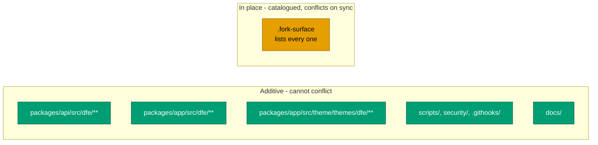

# What we changed

The catalogue of our divergence from upstream HyperDX. Keep it accurate: when
you add, remove or move a fork change, update this file in the same commit.

Two machine-readable companions carry the parts a script can check, and they are
the source of truth where this prose disagrees:

- `.fork-surface` - every sanctioned in-place edit to an upstream file
- `.upstream-version` - which upstream release we are built on

Why the fork is shaped this way is [design.md](design.md). How to move it to a
newer upstream is [sync-cycle.md](sync-cycle.md).

---

## Upstream base

- **Upstream:** <https://github.com/hyperdxio/hyperdx> (HyperDX v2)
- **Synced to:** whatever `.upstream-version` records. It is verified against
  `git merge-base` on every PR, so it cannot quietly drift from the tree.
- **Imported at:** commit `e58f01d` "Initial HyperDX commit", a FLATTENED copy
  of upstream rather than a continuation of their history.
  `scripts/fork-setup.sh` grafts it back on so blame and ancestry work - see
  [design.md](design.md#the-squashed-import-and-the-graft-that-repairs-it).
- **The `upstream` remote is required.** Without it the conflict-surface guard
  cannot tell our files from upstream's, and the verify checks decline to run
  rather than pass on nothing.
- **Our changes live on `main`**, merged in as feature PRs, not as a curated
  patch series rebased on a tracked upstream. That is why an upstream bump is a
  merge with real conflict surface rather than a clean rebase.

**RETIRED - the `.dfe[CHG]` shadow-copy convention.** Modified copies of
upstream files were once kept beside the originals with a `.dfe[CHG]` suffix. It
was never wired up (nothing imported the copies, the docker build ignored them),
it had drifted badly, and it blocked the build. All 32 shadow files were
removed. We modify upstream files IN PLACE now, which is why every such edit
must be catalogued in `.fork-surface`.

---

## Where our code lives

---

## Data layer: MongoDB to FerretDB and PostgreSQL

FerretDB speaks the MongoDB wire protocol over PostgreSQL with the DocumentDB
extension. **HyperDX application code is unchanged** - Mongoose, `connect-mongo`
and `passport-local-mongoose` all talk to FerretDB unmodified.

- `docker-compose.dfe.yml` - production override, replaces `db` with
  `postgres` + `ferretdb` and repoints `MONGO_URI`
- `docker-compose.dfe.dev.yml` - dev override

The FerretDB and postgres-documentdb images are a matched pair and must be
pinned together. FerretDB 2.x requires the DocumentDB extension and **cannot be
upgraded in place from 1.x** - it needs a clean install plus dump and restore.

Rationale:
[../decisions/0001-ferretdb-over-direct-postgres.md](../decisions/0001-ferretdb-over-direct-postgres.md).

## External OIDC authentication

The auth boundary moves out of HyperDX. Envoy (Kubernetes) or oauth2-proxy
(docker) runs the OIDC flow and forwards identity headers. HyperDX trusts
`x-oidc-*` / `X-Forwarded-*`, find-or-creates the user, and maps groups to
teams. It falls back to upstream session auth when the headers are absent.

- `packages/api/src/dfe/middleware/oidc-identity.ts` - trusted-header identity
- `packages/api/src/dfe/middleware/jwt-verify.ts` - ES384 verification against
  the provider JWKS
- `packages/api/src/dfe/controllers/user-provisioning.ts` - JIT user creation
- `packages/api/src/dfe/controllers/team-provisioning.ts` - group-to-team
  mapping
- `packages/api/src/api-app.ts` - wires the middleware behind `AUTH_MODE`
- `packages/api/src/routers/api/root.ts` - gates the legacy login and invite
  routes in OIDC mode

Detail:
[../architecture/oidc-authentication.md](../architecture/oidc-authentication.md).

## Authorization

**Casbin RBAC was REMOVED.** It was redundant: every HyperDX route handler
already self-scopes its queries by `team`, so tenant isolation holds without it
and cross-team access was never possible.

Authorization is owned by the DFE engine as the policy decision point, and
enforced at the data layer by ClickHouse GRANTs. HyperDX trusts the identity
injected at the edge.

Rationale:
[../decisions/0004-casbin-removed.md](../decisions/0004-casbin-removed.md).

**Admin surfaces are engine-only (`dfe/middleware/admin-lockdown.ts`).** HyperDX
is embedded-only, so a human uses it for search, saved searches, dashboards and
charts - nothing else. `requireServicePrincipal` 403s any non-service principal
on the admin surfaces wired in `api-app.ts` (`/team`, `/connections`,
`/sources`, `/webhooks`, `/alerts`, the external `/api/v2`, and `/mcp`), and
`blockClickhouseProxyTest` closes the connection-tester sub-route while leaving
the query proxy open. Both are a no-op when `DFE_AUTH_MODE` is unset, so
upstream behaviour and tests are unchanged. The service flag is set by
`jwt-verify.ts` for the `svc:dfe-engine` identity.

## DFE integration features

- `packages/api/src/dfe/routers/query-export.ts` - export a saved search or SQL
  to a DFE rule
- `packages/app/src/dfe/components/CreateRuleFromSearch/` - the button that
  posts to it. Deliberately uses plain `useState`, NOT react-query's
  `useMutation`: this component is injected into upstream's `DBSearchPage`,
  whose pristine tests render that page behind a PARTIAL `@tanstack/react-query`
  mock. Pulling a second hook out of that module makes upstream's tests explode.
  Keep our delta invisible to them.
- `packages/app/src/dfe/clickhouseJsonPath.ts` - native ClickHouse JSON columns.
  `col['k']` on a JSON column is `arrayElement`, which ClickHouse rejects, so we
  emit `JSONExtractString`; a JSON sub-path yields `Dynamic`, which
  `JSONExtract*` also rejects, so that ONE case is wrapped in `toString()`.
  Narrow by design - wrapping unconditionally changed the SQL for String and Map
  columns too.
- `packages/app/src/dfe/embedFeatures.ts` + `EmbedThemeSync.tsx` - chromeless
  embed mode: feature gating by route, and live theme sync from the host UI.
  `pages/_document.tsx` carries one added inline head script (`EMBED_INIT_SCRIPT`,
  alongside upstream's own `THEME_INIT_SCRIPT`) that sets `html.dfe-embed` from
  the `embed=1` URL param / persisted flag before hydration; `styles/globals.css`
  hides `.dfe-appnav-slot` (the layout.tsx wrapper) under that class, so the full
  chrome sidebar never flashes before React removes it.
- **Alerting is disabled, not removed.** HyperDX's alert checker is not started
  and its routes are hidden by the embed nav gating. Detection is the DFE rules
  engine's job. Rationale:
  [../decisions/0002-alerting-disabled-for-dfe-rules.md](../decisions/0002-alerting-disabled-for-dfe-rules.md).

## Config and bootstrap

- `packages/api/src/dfe/config.ts` - auth mode, header names, default team
- `.env.dfe-example` - DFE env template

## Branding and frontend

- `packages/app/src/theme/themes/dfe/**` - tokens, Mantine theme, logomark and
  wordmark assets. Typography is Inter + IBM Plex Mono - see ADR
  [0005](../decisions/0005-console-typography.md).
- `packages/app/src/dfe/components/**` - AppNav, SidebarMenu, ThemeToggle,
  UserActionsButton, LandingPage
- Search language defaults to SQL, not upstream's Lucene (an explicit user
  selection still wins). One seam: `getStoredLanguage()` in
  `components/SearchInput/SearchWhereInput.tsx` returns `'sql'` instead of null
  when nothing is stored, which flips every `?? 'lucene'` fallback at once; the
  three sites that bypassed the seam (`DBSearchPage.tsx` saved-search default,
  `DBDashboardPage.tsx` URL-parser default, `ContextSidePanel.tsx` destructure
  default) now consult it. Callers' dead `?? 'lucene'` tails are deliberately
  left to minimise the upstream diff. Pinned by
  `dfe/__tests__/searchLanguageDefault.test.ts`.

## Build, CI and tooling

- `.hyperi-ci.yaml`, `.github/workflows/ci.yml` - migrated to hyperi-ci
- `.github/workflows/{upstream-sync,upstream-drift,fork-surface,fork-security}.yml`
  - the fork machinery
- `.releaserc.json`, `.gitleaks.toml`, `scripts/audit.sh`
- `packages/api/jest.dfe.config.js` - upstream's unit config plus one transform:
  `jose` is ESM-only and Jest's CJS loader cannot load it, so the tests exercise
  real ES384 verification rather than a crypto double. It deliberately does NOT
  narrow `testMatch` - it used to, back when upstream's api package had no unit
  target, and 2.33.0 added one. A scoped config would run our handful of tests
  while silently skipping upstream's several hundred.
- `.upstream-version` + `scripts/upstream-pin.py` - the upstream pin, verified
  against `git merge-base` rather than trusted
- `security/overrides.yaml`, `security/patches/`,
  `scripts/security-override.py`, `scripts/security-triage.py` - the generated
  temporary security layer
- `.gitattributes` - ONE added line routing `yarn.lock` to
  `scripts/merge-lockfile.sh`

## Docs

Our documentation lives under [docs/](../README.md) and follows HyperI
standards. Upstream's docs - `AGENTS.md`, `agent_docs/`, `MCP.md`, `LOCAL.md`,
`DEPLOY.md`, `CONTRIBUTING.md` - are left exactly as upstream ships them.

`CLAUDE.md` is the one exception: upstream ships a one-line file, and we prepend
the fork's governing rule above it so it is unmissable at the top of every agent
session. Upstream rarely touches that line, so the conflict is small and rerere
replays it.

---

## Version and image

The fork version in `package.json` is the **HyperI** version, independent of the
upstream HyperDX app version. When pinning this fork in dfe-infra, use the image
tag this repo's CI publishes, NOT the upstream HyperDX version.

`git show <our-tag>:.upstream-version` answers "which upstream is release X
built on" for any release we have cut.

---

## Related

- [design.md](design.md) - why the fork is shaped this way
- [sync-cycle.md](sync-cycle.md) - how to move to a newer upstream
- [leaving-upstream.md](leaving-upstream.md) - how this ends
- The `x-oidc-*` contract is the universal seam shared with the rest of DFE -
  see the dfe-engine OIDC dual-mode design
