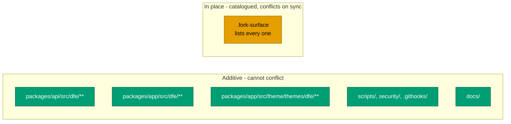

# What we changed

The catalogue of our divergence from upstream HyperDX. Keep it accurate: when
you add, remove or move a fork change, update this file in the same commit.

Two machine-readable companions carry the parts a script can check, and they are
the source of truth where this prose disagrees:

- `.fork-surface` - every sanctioned in-place edit to an upstream file
- `.upstream-version` - which upstream release we are built on

Why the fork is shaped this way is [design.md](design.md). How to move it to a
newer upstream is [sync-cycle.md](sync-cycle.md).

---

## Upstream base

- **Upstream:** <https://github.com/hyperdxio/hyperdx> (HyperDX v2)
- **Synced to:** whatever `.upstream-version` records. It is verified against
  `git merge-base` on every PR, so it cannot quietly drift from the tree.
- **Imported at:** commit `e58f01d` "Initial HyperDX commit", a FLATTENED copy
  of upstream rather than a continuation of their history.
  `scripts/fork-setup.sh` grafts it back on so blame and ancestry work - see
  [design.md](design.md#the-squashed-import-and-the-graft-that-repairs-it).
- **The `upstream` remote is required.** Without it the conflict-surface guard
  cannot tell our files from upstream's, and the verify checks decline to run
  rather than pass on nothing.
- **Our changes live on `main`**, merged in as feature PRs, not as a curated
  patch series rebased on a tracked upstream. That is why an upstream bump is a
  merge with real conflict surface rather than a clean rebase.

**RETIRED - the `.dfe[CHG]` shadow-copy convention.** Modified copies of
upstream files were once kept beside the originals with a `.dfe[CHG]` suffix. It
was never wired up (nothing imported the copies, the docker build ignored them),
it had drifted badly, and it blocked the build. All 32 shadow files were
removed. We modify upstream files IN PLACE now, which is why every such edit
must be catalogued in `.fork-surface`.

---

## Where our code lives

---

## Data layer: MongoDB to FerretDB and PostgreSQL

FerretDB speaks the MongoDB wire protocol over PostgreSQL with the DocumentDB
extension. **HyperDX application code is unchanged** - Mongoose, `connect-mongo`
and `passport-local-mongoose` all talk to FerretDB unmodified.

- `docker-compose.dfe.yml` - production override, replaces `db` with
  `postgres` + `ferretdb` and repoints `MONGO_URI`
- `docker-compose.dfe.dev.yml` - dev override

The FerretDB and postgres-documentdb images are a matched pair and must be
pinned together. FerretDB 2.x requires the DocumentDB extension and **cannot be
upgraded in place from 1.x** - it needs a clean install plus dump and restore.

Rationale:
[../decisions/0001-ferretdb-over-direct-postgres.md](../decisions/0001-ferretdb-over-direct-postgres.md).

## External OIDC authentication

The auth boundary moves out of HyperDX. Envoy (Kubernetes) or oauth2-proxy
(docker) runs the OIDC flow and forwards identity headers. HyperDX trusts
`x-oidc-*` / `X-Forwarded-*`, find-or-creates the user, and maps groups to
teams. It falls back to upstream session auth when the headers are absent.

- `packages/api/src/dfe/middleware/oidc-identity.ts` - trusted-header identity
- `packages/api/src/dfe/middleware/jwt-verify.ts` - ES384 verification against
  the provider JWKS
- `packages/api/src/dfe/controllers/user-provisioning.ts` - JIT user creation
- `packages/api/src/dfe/controllers/team-provisioning.ts` - group-to-team
  mapping
- `packages/api/src/api-app.ts` - wires the middleware behind `AUTH_MODE`
- `packages/api/src/routers/api/root.ts` - gates the legacy login and invite
  routes in OIDC mode

Detail:
[../architecture/oidc-authentication.md](../architecture/oidc-authentication.md).

## Authorization

**Casbin RBAC was REMOVED.** It was redundant: every HyperDX route handler
already self-scopes its queries by `team`, so tenant isolation holds without it
and cross-team access was never possible.

Authorization is owned by the DFE engine as the policy decision point, and
enforced at the data layer by ClickHouse GRANTs. HyperDX trusts the identity
injected at the edge.

Rationale:
[../decisions/0004-casbin-removed.md](../decisions/0004-casbin-removed.md).

**Admin surfaces are engine-only (`dfe/middleware/admin-lockdown.ts`).** HyperDX
is embedded-only, so a human uses it for search, saved searches, dashboards and
charts - nothing else. `requireServicePrincipal` 403s any non-service principal
on the admin surfaces wired in `api-app.ts` (`/team`, `/connections`,
`/sources`, `/webhooks`, `/alerts`, the external `/api/v2`, and `/mcp`), and
`blockClickhouseProxyTest` closes the connection-tester sub-route while leaving
the query proxy open. Both are a no-op when `DFE_AUTH_MODE` is unset, so
upstream behaviour and tests are unchanged. The service flag is set by
`jwt-verify.ts` for the `svc:dfe-engine` identity.

## DFE integration features

- `packages/api/src/dfe/controllers/org-connection.ts` - a team holds ONLY its
  own org's ClickHouse connection, fetched from the engine, plus its seed
  sources. `default` and `hunts` for every team (org-fenced by their row
  policies); `otel_logs`, `otel_traces`, `otel_metrics` and `clickhouse_system`
  for the platform team alone, since operator telemetry and ClickHouse's own
  `system` database must never reach an org_viewer. That source set is also the
  RBAC fence for the pre-canned dashboards - see the provisioner note below.
- `packages/api/src/dfe/routers/query-export.ts` - export a saved search or SQL
  to a DFE rule
- `packages/app/src/dfe/components/CreateRuleFromSearch/` - the button that
  posts to it. Deliberately uses plain `useState`, NOT react-query's
  `useMutation`: this component is injected into upstream's `DBSearchPage`,
  whose pristine tests render that page behind a PARTIAL `@tanstack/react-query`
  mock. Pulling a second hook out of that module makes upstream's tests explode.
  Keep our delta invisible to them.
- `packages/app/src/dfe/clickhouseJsonPath.ts` - native ClickHouse JSON columns.
  `col['k']` on a JSON column is `arrayElement`, which ClickHouse rejects, so we
  emit `JSONExtractString`; a JSON sub-path yields `Dynamic`, which
  `JSONExtract*` also rejects, so that ONE case is wrapped in `toString()`.
  Narrow by design - wrapping unconditionally changed the SQL for String and Map
  columns too.
- `packages/common-utils/src/dfe/jsonPath.ts` - native ClickHouse JSON for
  charts and filters. A JSON sub-path is `Dynamic`, which ClickHouse refuses in
  `IN`, aggregates, `GROUP BY` and `ORDER BY`, so it needs an explicit coercion.
  All the logic is here; **`core/renderChartConfig.ts` (catalogued)** carries
  three added calls and nothing else - one in `renderWhereExpressionStr`, the
  seam every SQL filter already passes through, one in `renderSelectList`'s
  raw-string early return, which `renderSelect` and `renderGroupBy` BOTH feed,
  so the SELECT list and the GROUP BY key cannot disagree, and one wrapping the
  `renderOrderBy` argument. Coercion is `toString()`, NOT the `.:String`
  sub-column upstream #2549 proposes - see the module header for the measurement
  that rules it out.

  Aggregate arguments are left alone: `aggFnExpr` already emits
  `toFloat64OrDefault(toString(expr))` around them, which our idempotence check
  recognises.

  ORDER BY was left alone until 2026-08-26 and now coerces via
  `dfeCoerceOrderBy`, which walks both the string and the `valueExpression[]`
  forms. This is a deliberate reversal, and it trades one wrong answer for
  another: previously a JSON sub-path was `Dynamic`, which ClickHouse refuses in
  ORDER BY, so the chart failed with a Code 44 that at least named its own fix.
  It now sorts, but `toString` sorts lexically - "99.5" above "1000.25". Sorting
  a numeric JSON path correctly needs the path's concrete TYPE, and
  `getJSONKeys` keeps only `typeArr[0]`, which for a mixed-type path is whatever
  ClickHouse happened to list first. That decision is still open and is tracked
  with max/min and facet values in the plan, since all three are the same
  question.

  Two shapes the seam must handle, both found by e2e and pinned by tests. A
  trailing `.:String` is a TYPE, not a path segment: quoting it as one reads a
  JSON key literally named `:String`, empty for every row. And
  `findJsonExpressions` returns the ENCLOSING call's closing paren attached when
  a path ends in a type specifier, so consuming it unbalances the aggregate
  around it - a syntax error that fails the whole facet batch and empties every
  other column's filter values with it.

  Stripping that suffix also settles the facet-value question without touching
  upstream's `renderJsonStringSubcolumn`: values coerce with `toString()`, so a
  mixed-type path stops under-matching, and upstream's six assertions on that
  function still pass.

  `dfeJsonPathRoot` in the same module serves a second catalogued call site, the
  facet dispatch in **`core/metadata.ts`**'s `getAllKeyValues`. That dispatch
  matches a key against the table's physical column names, and `parseKeyPath`
  splits BRACKET form only - so a JSON dot path arrives as one opaque segment,
  matches nothing, and falls out of the loop with neither a facet nor an error.
  That is why the filter sidebar listed no JSON sub-path at all. We match on the
  path's ROOT column instead and hand the path through intact. The same branch
  drops a bracket subscript on a JSON column, which is `arrayElement`: one
  illegal expression fails the whole batch and takes every other facet with it.

  Facet VALUES still render through upstream's `.:String`, so a path storing a
  non-String type in some rows lists an incomplete value set. Selecting a value
  is unaffected - the WHERE seam coerces with `toString()`, which matches a
  superset - so this costs completeness, never correctness. Changing it means
  editing upstream's own `metadata.test.ts` assertions, which is the most
  expensive delta shape we have.

- `packages/app/src/dfe/jsonColumns.ts` - which roots take dot access. Two
  catalogued call sites read it: **`components/SQLEditor/SQLInlineEditor.tsx`**
  (the chart-builder autocomplete rendered every nested path as `col['key']`,
  which is `arrayElement` on a JSON column) and
  **`hooks/useAutoCompleteOptions.tsx`** (passed an empty `jsonColumns` to
  `mergePath`, so the search bar's facet fetch silently returned nothing). Both
  now call `mergePath` with the JSON roots derived from the field list they
  already hold, so neither adds a query.
- `packages/app/jest.dfe.config.js` + `jest.dfe.setup.js` - pins
  `NEXT_PUBLIC_THEME=hyperdx` for app unit tests, so upstream's suite passes
  unchanged instead of us editing their test files to accommodate the rebrand.
  Mirrors `packages/api/jest.dfe.config.js`. The setup file is loaded by the
  jest config rather than compiled, so no tsconfig project covers it and typed
  linting cannot parse it; **`packages/app/eslint.config.mjs`** carries one
  added `ignores` entry for it, beside upstream's own `global-setup.js` line.
- `packages/app/src/dfe/defaultSource.ts` - which source `/search` opens on
  cold. DFE analysts work from hunt detections, so `hunts` is the landing view
  rather than whichever source sorts first. **`DBSearchPage.tsx` (catalogued)**
  carries the whole delta: one `??` on the existing fallback return in
  `getDefaultSourceId`, plus `& { name?: string }` on its parameter type. The
  name stays OPTIONAL so upstream's own tests, whose fixtures carry no name,
  still typecheck - and it is what makes them still pass, since a nameless
  fixture never matches a preference.

  Upstream's precedence is untouched and still wins: an explicit `?source=`, a
  saved search, and the user's last selection all take priority. dfe-ui's "Hunt
  Results" entry links `?source=hunts` for that reason - it must beat the last
  selection, which a bare `/search` deliberately does not. Upstream already
  resolves `?source=` by NAME as well as id (`useResolvedSourceParam`), so
  linking by name needs nothing here.

- `packages/app/playwright.dfe.config.ts` +
  `tests/e2e/dfe-global-setup-chrome.ts` - run e2e against the system Chrome.
  Playwright 1.57.0 ships no bundled Chromium for Ubuntu 26.04 and
  `playwright install chromium` refuses for that platform, so a DFE dev host can
  never fetch the pinned revision. The config sets `channel: 'chrome'` per
  project and raises the webServer budget (`E2E_APP_SERVER_TIMEOUT_MS`); the
  setup file exists because global setup calls `chromium.launch()` directly and
  so never sees the project config, and Playwright 1.57 honours no environment
  override for that call.

  The setup file sits BESIDE upstream's rather than under `src/dfe/`, because
  `@/` resolves to `src/` and cannot reach `tests/`, and the eslint config bans
  parent-relative imports. A `dfe-` prefix carries the ownership instead.

  It also seeds the stored WHERE language to Lucene in the saved storage state.
  The fork defaults that language to SQL (`6cf72984`), and upstream's
  `search-input` test id is rendered ONLY on the Lucene input -- the SQL branch
  renders `SQLInlineEditorControlled` and never receives it. Without the seed
  every upstream spec calling `performSearch` waits for an element that does not
  exist. Realigning the TEST environment leaves what a real DFE user gets
  unchanged, and rewriting upstream's specs is the alternative fork discipline
  rules out.

  Opt-in by construction: both apply only to a run passing
  `--config=playwright.dfe.config.ts`, so upstream's default path and CI, which
  do have a bundled Chromium, are untouched. Neither a dependency bump nor an
  edit to `playwright.config.ts` was needed. Mirrors the `jest.dfe.config.js`
  pattern.

- `packages/app/src/dfe/embedFeatures.ts` + `EmbedThemeSync.tsx` - chromeless
  embed mode: feature gating by route, and live theme sync from the host UI.
  `pages/_document.tsx` carries one added inline head script
  (`EMBED_INIT_SCRIPT`, alongside upstream's own `THEME_INIT_SCRIPT`) that sets
  `html.dfe-embed` from the `embed=1` URL param / persisted flag before
  hydration; `styles/globals.css` hides `.dfe-appnav-slot` (the layout.tsx
  wrapper) under that class, so the full chrome sidebar never flashes before
  React removes it.
- **Alerting is disabled, not removed.** HyperDX's alert checker is not started
  and its routes are hidden by the embed nav gating. Detection is the DFE rules
  engine's job. Rationale:
  [../decisions/0002-alerting-disabled-for-dfe-rules.md](../decisions/0002-alerting-disabled-for-dfe-rules.md).
- `packages/api/src/dfe/middleware/provisioned-lockdown.ts` - 403 on PATCH and
  DELETE against a dashboard the provisioner owns. Not polish: the provisioner
  runs on a one-minute cron and `$set`s tiles every pass, so an unguarded edit
  is reverted within 60s with no error. Users take their own copy through Export
  Dashboard -> Import Dashboard, which needed no change.
- **`packages/api/src/tasks/provisionDashboards/index.ts` - the one edit to a
  pristine upstream file** (catalogued in `.fork-surface`). `syncDashboards`
  wrote tiles verbatim, so a file naming a source by name stored a name where an
  ObjectId belongs and the tile rendered dead; upstream's own
  `AUTO_PROVISION.md` example has the same bug. `resolveDashboardRefs` matches
  source and connection names case-insensitively, as `DBDashboardImportPage`
  does interactively. Unresolvable references pass through unchanged by default,
  so upstream's behaviour and its dangling-source fixture still hold;
  `DASHBOARD_PROVISIONER_REQUIRE_REFS=true` skips the dashboard instead. That
  flag is the RBAC mechanism for the DFE set: a tenant team holds no otel
  source, so the platform dashboards never resolve for it. Content is
  dfe-engine's, mounted in by dfe-infra and dfe-docker.

## Config and bootstrap

- `packages/api/src/dfe/config.ts` - auth mode, header names, default team
- `.env.dfe-example` - DFE env template

## Branding and frontend

- `packages/app/src/theme/themes/dfe/**` - tokens, Mantine theme, logomark and
  wordmark assets. Typography is Inter + IBM Plex Mono - see ADR
  [0005](../decisions/0005-console-typography.md).
- `packages/app/src/dfe/components/**` - AppNav, SidebarMenu, ThemeToggle,
  UserActionsButton, LandingPage
- Search language defaults to SQL, not upstream's Lucene (an explicit user
  selection still wins). One seam: `getStoredLanguage()` in
  `components/SearchInput/SearchWhereInput.tsx` returns `'sql'` instead of null
  when nothing is stored, which flips every `?? 'lucene'` fallback at once; the
  three sites that bypassed the seam (`DBSearchPage.tsx` saved-search default,
  `DBDashboardPage.tsx` URL-parser default, `ContextSidePanel.tsx` destructure
  default) now consult it. Callers' dead `?? 'lucene'` tails are deliberately
  left to minimise the upstream diff. Pinned by
  `dfe/__tests__/searchLanguageDefault.test.ts`.

## Build, CI and tooling

- `.hyperi-ci.yaml`, `.github/workflows/ci.yml` - migrated to hyperi-ci
- `.github/workflows/{upstream-sync,upstream-drift,fork-surface,fork-security}.yml`
  - the fork machinery
- `.releaserc.json`, `.gitleaks.toml`, `scripts/audit.sh`
- `packages/api/jest.dfe.config.js` - upstream's unit config plus one transform:
  `jose` is ESM-only and Jest's CJS loader cannot load it, so the tests exercise
  real ES384 verification rather than a crypto double. It deliberately does NOT
  narrow `testMatch` - it used to, back when upstream's api package had no unit
  target, and 2.33.0 added one. A scoped config would run our handful of tests
  while silently skipping upstream's several hundred.
- `.upstream-version` + `scripts/upstream-pin.py` - the upstream pin, verified
  against `git merge-base` rather than trusted
- `security/overrides.yaml`, `security/patches/`,
  `scripts/security-override.py`, `scripts/security-triage.py` - the generated
  temporary security layer
- `.gitattributes` - ONE added line routing `yarn.lock` to
  `scripts/merge-lockfile.sh`
- `knip.json` - added ignores so the pre-commit hook can run. Two classes, and
  neither is ours to fix. Upstream page components orphaned because this fork
  removed their routes (`pages/{benchmark,clickhouse,join-team,kubernetes,`
  `service-map,services,sessions,team}.tsx`), and upstream's own debris - the
  `jsonwebtoken` dependency they left declared after removing its code in
  `f34cfaed`. Ignored rather than deleted: dead upstream files are never
  imported so Next never bundles them, and removing 5,000 lines of upstream code
  buys a delete/modify conflict on every sync for no runtime gain. Worth raising
  upstream.
- `.yarnrc.yml` - one added `npmAuditIgnoreAdvisories` block. The audit gate
  runs `yarn npm audit` against the lockfile, so it reports on upstream's whole
  tree including devDependencies, and there is no line of code to tag. Excluded
  by advisory id, never by package name - `npmAuditExcludePackages` would mute
  the next advisory against the same package too. Each id carries its reason and
  the traces are in [security-sync.md](security-sync.md). Upstream churns this
  file rarely, so the conflict is small.
- `.fork-deleted` + the deletion check in `.githooks/fork-surface-check.py` -
  the 15 upstream workflows we do not carry. `.fork-surface` cannot cover a
  deletion: it reads `--diff-filter=ACMR` against the merge base, where a file
  we removed is unchanged and therefore invisible, so a sync reinstates it in
  silence. The check simply fails when a listed path exists.
- `scripts/ci/__tests__/**` in `knip.json` - upstream's ratchet test. Only
  upstream's `main.yml` ever ran it, and we do not carry that workflow, so knip
  is correct that nothing uses it. Ignored rather than deleted, on the same
  reasoning as the orphaned upstream pages: removing an upstream file buys a
  delete/modify conflict on every sync. **`scripts/ci/ratchet.mjs` itself is
  therefore not wired into our CI either** - run it by hand, or give it a home.
- `scripts/ci/ratchet-baseline.json` - upstream's escape-hatch ratchet, our
  numbers. The baseline is the floor for `as any` and `eslint-disable` counts
  per package, so every hatch we remove has to be locked in here or the ratchet
  nags on every run and the improvement is free to be undone. Upstream has
  touched the file four times, and the conflict is trivial either way: take
  ours, then re-run `yarn ratchet:update` after the sync so the numbers match
  the merged tree.
- `package.json` `resolutions` - one generated fork pin,
  `systeminformation ^5.31.7`, raising upstream's own `^5.24.0`. It is generated
  from `security/overrides.yaml` by `scripts/security-override.py --apply`, so
  edit the register, never this line. The vector is in the register entry.
  `--check` currently reports it REDUNDANT: it compares our floor against the
  lockfile resolution our own pin produced, so it cannot tell an upstream fix
  from ours. The pin is real - the lockfile moved 5.30.7 to 5.33.1 when it was
  applied. `--verify`, which is what CI gates on, passes.

## Docs

Our documentation lives under [docs/](../README.md) and follows HyperI
standards. Upstream's docs - `AGENTS.md`, `agent_docs/`, `MCP.md`, `LOCAL.md`,
`DEPLOY.md`, `CONTRIBUTING.md` - are left exactly as upstream ships them.

`CLAUDE.md` is the one exception: upstream ships a one-line file, and we prepend
the fork's governing rule above it so it is unmissable at the top of every agent
session. Upstream rarely touches that line, so the conflict is small and rerere
replays it.

---

## Version and image

The fork version in `package.json` is the **HyperI** version, independent of the
upstream HyperDX app version. When pinning this fork in dfe-infra, use the image
tag this repo's CI publishes, NOT the upstream HyperDX version.

That image is `ghcr.io/hyperi-io/dfe-hyperdx`, built by hyperi-ci from
`publish.container` in `.hyperi-ci.yaml` using the root `Dockerfile` (amd64
only - the arm64 half runs under qemu and Next's build-time font fetch times
out). GHCR is the only registry hyperi-ci publishes to. Upstream's `release.yml`
pushes to Docker Hub under `hyperdx/*` and `clickhouse/*`, which are not ours -
that workflow is deliberately absent from `main`.

`git show <our-tag>:.upstream-version` answers "which upstream is release X
built on" for any release we have cut.

---

## Related

- [design.md](design.md) - why the fork is shaped this way
- [sync-cycle.md](sync-cycle.md) - how to move to a newer upstream
- [security-sync.md](security-sync.md) - what we have learnt about the inherited
  dependency tree, one dated section per sync
- [leaving-upstream.md](leaving-upstream.md) - how this ends
- The `x-oidc-*` contract is the universal seam shared with the rest of DFE -
  see the dfe-engine OIDC dual-mode design
